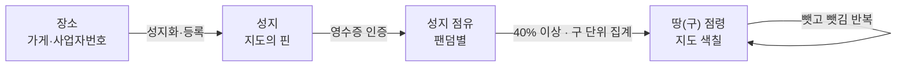
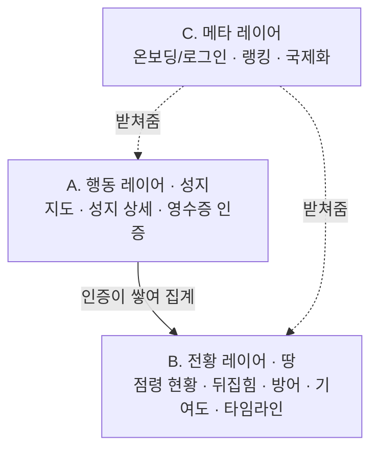

> **트랙**: 퀵 실험형 (오너 = 도란 본인 서비스). 투자·매각은 후순위 — BM·경쟁분석은 최소화하고 검증되면 붙인다.
> **이 문서**: 개요 + 서비스의 "세계관"(용어·판정기준·핵심 로직). **"무엇이 참인가"를 정의**한다. 화면·동작은 [문서 2 — 기능 명세], 리스크·확장은 [문서 3]에서 다룬다.
# 1. 한 줄 정의
특정 IP 팬들이 오프라인 성지(팝업·생일카페·스타 단골집 등)에서 결제한 **영수증을 AI로 인증**해, 지도를 자신의 **팬덤 컬러로 점령**해 나가는 위치기반 게이미피케이션 서비스.
## 기본 구조
장소가 성지가 되고, 인증이 성지를 팬덤 색으로 칠하고, 성지들이 모여 구(땅)를 점령한다.

기능은 3개 레이어로 쌓인다.

> **한 문장 요약**: 한 장소 위에 성지가 얹히고, 성지에 인증이 쌓이며, 각 인증은 한 팬덤에 귀속돼 성지의 점유율을 만들고, 성지 점유가 구(땅) 단위로 집계돼 지도가 팬덤 색으로 칠해진다.
# 2. MVP에서 검증할 단 하나
**"팬덤 점령 놀이가 실제로 재밌고 바이럴되는가."**
이걸 확인하려고 파트너(매장·주최자)는 시스템에 직접 참여시키지 않고 운영자가 등록·검수를 대행한다. 팬 경험만 진짜로 만든다.
<table header-row="true">
<tr>
<td>구분</td>
<td>내용</td>
</tr>
<tr>
<td>mvp포함</td>
<td>  • 소수 IP(1\~2개 팬덤군)    • 성지 밀집 1\\~2개 구(예: 성수·홍대)    • 영수증 OCR 인증   • 성지 지도   • 점유 시각화   • 랭킹</td>
</tr>
<tr>
<td>mvp제외</td>
<td>  • SNS 자동맵핑(→ 초기엔 운영자 직접 큐레이션)    • 팬 제보 기능   • 다중 파트너 권한관리    • GPS 체크인형 인증    • 사업자번호 자동대조 풀버(→ 초기엔 수동검수 위주)</td>
</tr>
</table>
# 3. 용어·개념 정의
6개 핵심 개념. 카페 "어반소스"(성수동)를 예로 든다.
### 팬 (User)
- **정의**: 선호 IP를 정하고 성지에서 인증해 땅을 넓히는 서비스 사용자.
- **주요 속성**: 선호 팬덤(다중), 표시 언어(locale), 누적 점수.
- **정책**: 팬임을 증명하는 절차 없음 — 인증 시 귀속 팬덤을 자기 신고로 고른다. 선호 팬덤은 여러 개·언제든 변경.
- **경계**: 팬덤 "소속"을 강제하지 않는다. 한 유저가 여러 팬덤으로 활동 가능(단 인증 1건은 팬덤 1개에 귀속).
- **MVP**: 소셜 OAuth 100% 전용 (구글, 카카오, 애플 / 이메일 가입 미지원), 한국 휴대폰 인증 비의존(외국인 포용).
- 📄 **세부 정책**: [fandom_팬_상세정책_v0.1_20260722.md](file:///Users/jmk/develop/fandom-conquest/docs/01_planning/02_detail/fandom_팬_상세정책_v0.1_20260722.md)

### 장소 (Place)
- **정의**: 현실의 그 가게. 사업자번호로 식별되는 물리적 사업장.
- **주요 속성**: 상호, 주소, 좌표, 사업자번호, 소속 구(region), 상태(운영/폐업).
- **정책**: 유일키 = 사업자번호. 상호·주소 표기가 흔들려도 사업자번호 같으면 동일 장소. 사업자번호가 바뀌면(양도·신규) 새 장소.
- **경계**: 장소 ≠ 성지 — 장소는 그릇, 성지는 그 위에 얹히는 이벤트. 폐업·변경돼도 삭제 금지, status=closed(과거 인증 보존).
- **MVP**: 운영자 수동 등록. 결제 사업자번호 없는 곳(공원·벽화)은 장소로도 안 들어옴.
- 📄 **세부 정책**: [fandom_장소_상세정책_v0.1_20260722.md](file:///Users/jmk/develop/fandom-conquest/docs/01_planning/02_detail/fandom_장소_상세정책_v0.1_20260722.md)

### 성지 (Spot)
- **정의**: 팬덤 맥락 + 결제 영수증이 나오는 지점. 지도의 핀, 점수를 버는 "총알".
- **주요 속성**: 장소(FK), 유형(이벤트형/상설형), 귀속 팬덤, 운영기간, 상태(active/archived).
- **정책**: 사업자번호 등록된 장소 위에 생성. 이벤트 단위로 살고 종료 시 아카이브. 점유율 40% 이상이면 점령 컬러링.
- **경계**: 성지 ≠ 장소 — 장소는 그릇, 성지는 그 위 이벤트. 결제 영수증 안 나오면 성지 불가(MVP).
- **MVP**: 운영자 수동 등록, 결제형만.
- 📄 **세부 정책**: [fandom_성지_상세정책_v0.1_20260722.md](file:///Users/jmk/develop/fandom-conquest/docs/01_planning/02_detail/fandom_성지_상세정책_v0.1_20260722.md)

### 인증 (Verification)
- **정의**: 유저가 성지에서 결제하고 영수증을 올린 행위 하나. 점수의 최소 단위.
- **주요 속성**: 유저, 성지, 귀속 팬덤, dedup_key(승인번호/조합키), 거래일시·금액, 좌표·GPS 통과여부, 상태(대기/자동승인/수동검수/승인/반려).
- **정책**: 1건 = 1점. 귀속 팬덤은 인증 시 선택. dedup_key 유니크로 중복 차단. 성지당 쿨다운(1일 1회 등).
- **경계**: 인증은 "행위 로그"이지 팬 증명이 아니다. 결제가 없으면(무료 방문) 인증 불가(MVP 결제형).
- **MVP**: OCR 자동 + 초기엔 수동검수 위주. 4겹 방어는 5장.
- 📄 **세부 정책**: [fandom_인증_상세정책_v0.1_20260722.md](file:///Users/jmk/develop/fandom-conquest/docs/01_planning/02_detail/fandom_인증_상세정책_v0.1_20260722.md)

- **정책**: 점령·랭킹의 집계 단위. 그룹(GROUP), 유닛(UNIT), 개인/솔로/배우(SOLO) 3계층 아키텍처로 확장.
- **점수 상속**: 개인/유닛 인증 시 최상위 단체 그룹 점수로 **단방향 상향 상속(Upward Roll-up Only)** 자동 합산. 단체 그룹 인증 시 하위 개인 멤버로의 하향 분배는 금지.
- **표기 롤 분담**: 성지 핀 마커는 **개인 시그니처 컬러/엠블럼**, 25구 영토 채색은 **그룹 합산 점수** 기준.

- 📄 **세부 정책**: [fandom_팬덤_상세정책_v0.1_20260722.md](file:///Users/jmk/develop/fandom-conquest/docs/01_planning/02_detail/fandom_팬덤_상세정책_v0.1_20260722.md)

### 땅/영역 (Territory)
- **정의**: 인증이 쌓여 팬덤 색으로 칠해지는 면(구 단위). 뺏고 뺏기는 점령지.
- **주요 속성**(파생값, 저장 안 함): 구, 팬덤별 점유 점수, 현재 1위 팬덤, 상태(점령/경합/중립).
- **정책**: 성지 점유가 구로 집계(2레벨). 40% 이상 1위면 점령 컬러링. 감쇠 반영해 실시간 유동(뺏김 가능).
- **경계**: 땅은 점령의 "결과물"이지 유저가 직접 만드는 대상이 아니다 — 성지(총알)의 집계. 행정동까지 쪼개지 않음.
- **MVP**: 성지 밀집 1\~2개 구.
- 📄 **세부 정책**: [fandom_땅_상세정책_v0.1_20260722.md](file:///Users/jmk/develop/fandom-conquest/docs/01_planning/02_detail/fandom_땅_상세정책_v0.1_20260722.md)
<empty-block/>
# 4. 점유·감쇠·점령 로직 (게임의 심장)
## 4.1 성지 단위
- **사업자번호 1개 = 장소 1개**가 기준. 성지의 정체성은 **이벤트 단위**.
- **이벤트형 성지**(기본): "장소 × 이벤트(기간)"이 하나의 성지. 예) `어반소스 × 하니 생일(3/1~3/3)`. 종료 시 **아카이브**, 다음 이벤트는 새 성지.
- **상설형 성지**: 단골집·촬영지처럼 상시 존재 → **장소 고정**.
## 4.2 점수 · 감쇠 · 점수 상속 룰 (Score Cascade)
- **점수**: **인증 1건 = 1점 고정**(MVP는 균등). 팬덤별 합산, 결제액이 아니라 건수 기반(금액 펌핑 방지). 성지 난이도·첫방문 보너스 같은 가중치는 밸런싱이 복잡해 검증 후로.
- **점수 이중 집계 및 단방향 상향 상속 룰 (Upward Roll-up Only)**:
  - **[하위 → 상위] 상향 상속 허용**: 유저가 개인 멤버(예: 승관) 또는 유닛(예: 부석순)으로 인증한 경우, **상위 속한 단체 그룹(예: 세븐틴)의 전체 점수에도 100% 자동 상향 합산**됩니다.
  - **[상위 → 하위] 하향 분배 금지**: 유저가 단체 그룹(예: 세븐틴)으로 인증한 경우, **하위 소속 개인 멤버들에게 점수가 분배/상속되지 않습니다.** (그룹 점수만 +1점 반영)
  - **이유**: 개인 팬과 그룹 팬덤(All-fan)이 함께 협력하는 팬덤 시너지를 창출하고, 지도 성지 핀 마커는 **개인 시그니처 컬러/엠블럼**, 25구 영역 채색은 **그룹 합산 전체 점수**로 계산하여 대항전 스케일 유지.
- **감쇠**: 이벤트형 성지는 **운영기간에 위임**(종료일에 확정 후 아카이브). 상설형 성지는 **최근 14일 롤링 가중**(지속 방문 유도 + 역전 가능).
## 4.3 점령 판정 · 집계 · 3대 랭킹 뷰
- **점령**: 팬덤 점유율 **40% 이상**이면 그 성지를 점령으로 보고 컬러링. 다른 팬덤이 넘어서면 뺏김.
- **집계**: 성지 → 구(區) **2레벨**. (행정동까지 쪼개면 초기엔 지도가 휑함)
- **앱 3대 랭킹 뷰 (Leaderboards)**:
  1. `통합 그룹 랭킹`: 속한 모든 개인/유닛 멤버 점수를 합산한 그룹 전체 랭킹 (예: 1위 뉴진스, 2위 세븐틴)
  2. `개인 / 솔로 랭킹`: 개인 멤버 및 배우 간의 순수 개별 랭킹 (예: 1위 변우석, 2위 승관)
  3. `그룹 내 최애 랭킹`: 특정 그룹 안에서 멤버별 기여도 % (예: 세븐틴 내 1위 승관 34%)

# 5. 어뷰징 방어 규칙
<table header-row="true">
<tr>
<td>겹</td>
<td>장치</td>
<td>막는 것</td>
</tr>
<tr>
<td>1차 (핵심)</td>
<td>**영수증 고유성** — 승인번호를 유니크 키로. 못 잡으면 (거래일시+사업자번호+금액) 조합키로 대체</td>
<td>재업로드·캡처 도용</td>
</tr>
<tr>
<td>2차</td>
<td>**GPS 대조** — 성지 반경(예: 200m) 밖이면 하드 차단이 아니라 플래그 → 수동검수 큐</td>
<td>남의 영수증으로 원격 인증</td>
</tr>
<tr>
<td>3차</td>
<td>**횟수·쿨다운** — 성지당 1일 1회 등 상한. 점수가 건수 기반이라 금액 펌핑 무의미</td>
<td>소액결제 반복 펌핑</td>
</tr>
<tr>
<td>4차 (안전망)</td>
<td>**이상탐지 → 수동검수 큐** — 급증·다계정 등 자동승인 보류</td>
<td>조직적 조작</td>
</tr>
</table>
이벤트 기간이 짧아 막판 조작이 결과를 뒤집을 수 있다. **4겹** 방어, 앞 3개가 핵심.
