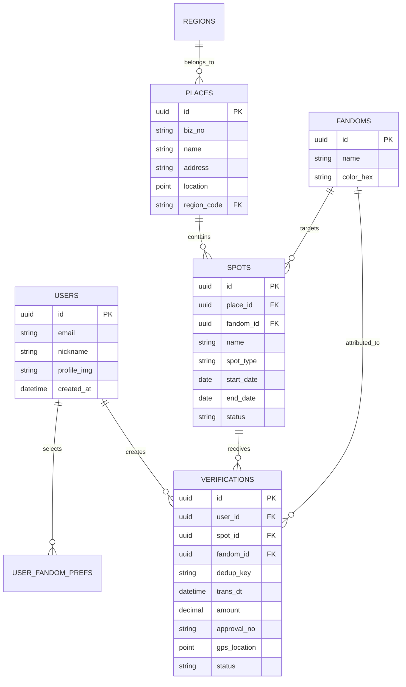

# 팬덤 땅따먹기 상세기획 — 데이터 모델 (Database Data Model)

> 본 문서는 '팬덤 땅따먹기' 백엔드 DB 설계 및 ERD 구성을 위한 **엔티티 스키마, 필드명, 데이터 타입, 제약조건, FK 관계 및 Enum 정의**를 다룬다.

---

## 1. ERD 엔티티 관계도 (Entity Relationship Diagram)

---

## 2. 테이블별 상세 스키마 명세

### 2.1 `users` (유저 정보)
| 필드명 | 타입 | Null | 제약조건 / 설명 |
| :--- | :--- | :--- | :--- |
| `id` | `UUID` | NO | **PK**, 기본키 |
| `email` | `VARCHAR(255)` | NO | **Unique**, 이메일 (소셜 연동) |
| `provider` | `VARCHAR(20)` | NO | Enum: `GOOGLE`, `KAKAO`, `APPLE` |
| `nickname` | `VARCHAR(20)` | NO | **Unique**, 유저 닉네임 (2~12자) |
| `profile_img` | `VARCHAR(512)` | YES | 프로필 이미지 URL |
| `locale` | `VARCHAR(10)` | NO | Default: `'ko-KR'`, 다국어 언어 코드 |
| `status` | `VARCHAR(20)` | NO | Default: `'ACTIVE'`, Enum: `ACTIVE`, `SUSPENDED`, `DELETED` |
| `created_at` | `TIMESTAMP` | NO | 가입 일시 |

### 2.2 `user_fandom_prefs` (유저 선호 팬덤)
| 필드명 | 타입 | Null | 제약조건 / 설명 |
| :--- | :--- | :--- | :--- |
| `id` | `BIGINT` | NO | **PK**, Auto Increment |
| `user_id` | `UUID` | NO | **FK** ➔ `users.id` |
| `fandom_id` | `UUID` | NO | **FK** ➔ `fandoms.id` |
| `is_main` | `BOOLEAN` | NO | Default: `FALSE`, 대표 메인 팬덤 여부 |

### 2.3 `places` (장소 가맹점)
| 필드명 | 타입 | Null | 제약조건 / 설명 |
| :--- | :--- | :--- | :--- |
| `id` | `UUID` | NO | **PK**, 기본키 |
| `biz_no` | `VARCHAR(12)` | NO | **Unique Index**, 사업자등록번호 (10자리) |
| `name` | `VARCHAR(100)` | NO | 상호명 (예: 어반소스) |
| `address` | `VARCHAR(255)` | NO | 도로명 주소 |
| `region_code` | `VARCHAR(20)` | NO | 소속 구 코드 (예: `KR-SEOUL-MAPO`) |
| `latitude` | `DECIMAL(10,7)` | NO | 위도 |
| `longitude` | `DECIMAL(10,7)` | NO | 경도 |
| `status` | `VARCHAR(20)` | NO | Default: `'OPEN'`, Enum: `OPEN`, `CLOSED` |

### 2.4 `spots` (성지 핀)
| 필드명 | 타입 | Null | 제약조건 / 설명 |
| :--- | :--- | :--- | :--- |
| `id` | `UUID` | NO | **PK**, 기본키 |
| `place_id` | `UUID` | NO | **FK** ➔ `places.id` |
| `fandom_id` | `UUID` | NO | **FK** ➔ `fandoms.id` (귀속 IP) |
| `title` | `VARCHAR(100)` | NO | 성지 이벤트명 (예: 하니 생일카페) |
| `spot_type` | `VARCHAR(20)` | NO | Enum: `EVENT` (이벤트형), `PERMANENT` (상설형) |
| `start_date` | `DATE` | YES | 이벤트 시작일 (`EVENT` 전용) |
| `end_date` | `DATE` | YES | 이벤트 종료일 (`EVENT` 전용) |
| `status` | `VARCHAR(20)` | NO | Default: `'ACTIVE'`, Enum: `ACTIVE`, `ARCHIVED` |

### 2.5 `verifications` (영수증 인증 로그)
| 필드명 | 타입 | Null | 제약조건 / 설명 |
| :--- | :--- | :--- | :--- |
| `id` | `UUID` | NO | **PK**, 기본키 |
| `user_id` | `UUID` | YES | **FK** ➔ `users.id` (탈퇴 시 Nullable 익명화) |
| `spot_id` | `UUID` | NO | **FK** ➔ `spots.id` |
| `fandom_id` | `UUID` | NO | **FK** ➔ `fandoms.id` (인증 당시 귀속 팬덤) |
| `dedup_key` | `VARCHAR(128)` | NO | **Unique Index**, `biz_no + approval_no` 중복 차단키 |
| `trans_dt` | `TIMESTAMP` | NO | 영수증 결제 일시 |
| `amount` | `DECIMAL(12,2)`| NO | 결제 금액 (KRW) |
| `approval_no` | `VARCHAR(50)` | YES | 승인번호 |
| `user_lat` | `DECIMAL(10,7)` | YES | 유저 인증 제출 시 위도 |
| `user_lng` | `DECIMAL(10,7)` | YES | 유저 인증 제출 시 경도 |
| `gps_valid` | `BOOLEAN` | NO | Default: `TRUE`, GPS 200m 이내 여부 |
| `status` | `VARCHAR(20)` | NO | Enum: `PENDING`, `APPROVED`, `MANUAL_REVIEW`, `REJECTED` |
| `created_at` | `TIMESTAMP` | NO | 인증 제출 일시 |

### 2.6 `fandoms` (팬덤 팀)
| 필드명 | 타입 | Null | 제약조건 / 설명 |
| :--- | :--- | :--- | :--- |
| `id` | `UUID` | NO | **PK**, 기본키 |
| `name` | `VARCHAR(50)` | NO | **Unique**, 팬덤 IP 이름 (예: NewJeans, IVE) |
| `color_hex` | `VARCHAR(7)` | NO | 대표 고유 컬러 Hex 코드 (예: `#1E88E5`) |

### 2.7 `notifications` (알림 이력)  -- ✨ (신규 추가)
| 필드명 | 타입 | Null | 제약조건 / 설명 |
| :--- | :--- | :--- | :--- |
| `id` | `BIGINT` | NO | **PK**, Auto Increment |
| `user_id` | `UUID` | NO | **FK** ➔ `users.id` |
| `title` | `VARCHAR(100)` | NO | 알림 제목 (예: ⚠️ 마포구가 위태로워요!) |
| `body` | `VARCHAR(255)` | NO | 알림 내용 카피 |
| `type` | `VARCHAR(30)` | NO | Enum: `FLIP_OVER` (뒤집힘), `DEFENSE` (위태로움), `VERIF_RESULT` (인증결과) |
| `target_url` | `VARCHAR(255)` | YES | 딥링크 URL (클릭 시 이동할 구/성지) |
| `is_read` | `BOOLEAN` | NO | Default: `FALSE`, 읽음 여부 |
| `created_at` | `TIMESTAMP` | NO | 알림 생성 일시 |

### 2.8 `spot_proposals` (유저 성지 제보)  -- ✨ (신규 추가)
| 필드명 | 타입 | Null | 제약조건 / 설명 |
| :--- | :--- | :--- | :--- |
| `id` | `UUID` | NO | **PK**, 기본키 |
| `user_id` | `UUID` | NO | **FK** ➔ `users.id` |
| `place_name` | `VARCHAR(100)` | NO | 상호명 |
| `address` | `VARCHAR(255)` | NO | 도로명 주소 |
| `spot_title` | `VARCHAR(100)` | NO | 이벤트/성지명 |
| `fandom_id` | `UUID` | NO | **FK** ➔ `fandoms.id` |
| `poster_img` | `VARCHAR(512)` | YES | 포스터/인증샷 URL |
| `status` | `VARCHAR(20)` | NO | Default: `'PENDING'`, Enum: `PENDING`, `APPROVED`, `REJECTED` |
| `created_at` | `TIMESTAMP` | NO | 제보 제출 일시 |

---

## 3. 주요 데이터베이스 인덱스 설계 (Indexes)

1. **`verifications` 테이블**:
   * `CREATE UNIQUE INDEX idx_dedup_key ON verifications(dedup_key);` (중복 인증 근본 차단)
   * `CREATE INDEX idx_verif_spot_fandom ON verifications(spot_id, fandom_id, status);` (성지별 점유율 빠른 집계)
2. **`places` 테이블**:
   * `CREATE UNIQUE INDEX idx_places_biz_no ON places(biz_no);` (사업자번호 식별)
3. **`spots` 테이블**:
   * `CREATE INDEX idx_spots_status_date ON spots(status, end_date);` (아카이빙 스케줄러 배치용)
