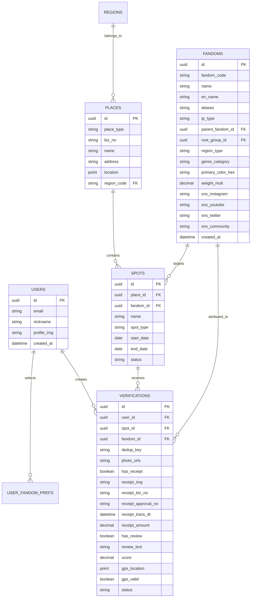

# 팬덤 땅따먹기 상세기획 — 데이터 모델 (Database Data Model)

> **문서 버전**: v0.2
> **최종 수정일**: 2026-08-17
> **문서 상태**: Approved Spec
> 본 문서는 '팬덤 땅따먹기' 백엔드 DB 설계 및 ERD 구성을 위한 **엔티티 스키마, 필드명, 데이터 타입, 제약조건, FK 관계 및 Enum 정의**를 다룬다.
> 🔄 **v0.2 반영**: [fandom_인증다변화_기획제안_v0.1_20260729.md](file:///Users/jmk/develop/fandom-conquest/docs/01_planning/03_discussion/fandom_인증다변화_기획제안_v0.1_20260729.md) 논의안 채택에 따라 `places`/`verifications` 스키마를 GPS+사진 기본 인증 및 영수증/리뷰 가산 점수 모델에 맞게 개편.

---

## 1. ERD 엔티티 관계도 (Entity Relationship Diagram)

---

## 2. 테이블별 상세 스키마 명세

### 2.1 `users` (유저 정보)
| 필드명 | 타입 | Null | 제약조건 / 설명 |
| :--- | :--- | :--- | :--- |
| `id` | `UUID` | NO | **PK**, 기본키 |
| `email` | `VARCHAR(255)` | NO | **Unique**, 이메일 (소셜 연동) |
| `provider` | `VARCHAR(20)` | NO | Enum: `GOOGLE`, `KAKAO`, `APPLE` |
| `nickname` | `VARCHAR(20)` | NO | **Unique**, 유저 닉네임 (2~12자) |
| `profile_img` | `VARCHAR(512)` | YES | 프로필 이미지 URL |
| `locale` | `VARCHAR(10)` | NO | Default: `'ko-KR'`, 다국어 언어 코드 |
| `status` | `VARCHAR(20)` | NO | Default: `'ACTIVE'`, Enum: `ACTIVE`, `SUSPENDED`, `DELETED` |
| `created_at` | `TIMESTAMP` | NO | 가입 일시 |

### 2.2 `user_fandom_prefs` (유저 선호 팬덤)
| 필드명 | 타입 | Null | 제약조건 / 설명 |
| :--- | :--- | :--- | :--- |
| `id` | `BIGINT` | NO | **PK**, Auto Increment |
| `user_id` | `UUID` | NO | **FK** ➔ `users.id` |
| `fandom_id` | `UUID` | NO | **FK** ➔ `fandoms.id` |
| `is_main` | `BOOLEAN` | NO | Default: `FALSE`, 대표 메인 팬덤 여부 |

### 2.3 `places` (장소 가맹점)
| 필드명 | 타입 | Null | 제약조건 / 설명 |
| :--- | :--- | :--- | :--- |
| `id` | `UUID` | NO | **PK**, 기본키 |
| `place_type` | `VARCHAR(20)` | NO | ✨(v0.2) Default: `'BUSINESS'`, Enum: `BUSINESS`(상업 가맹점), `PUBLIC`(비상업 공공/야외 성지 — 벽화, 촬영지, 기념 공원, 조형물 등) |
| `biz_no` | `VARCHAR(12)` | **YES** | ✨(v0.2) `place_type = PUBLIC`인 경우 사업자등록번호가 없으므로 `Nullable`로 전환. `BUSINESS`인 경우 등록 권장 |
| `name` | `VARCHAR(100)` | NO | 상호명 (예: 어반소스) / `PUBLIC` 유형은 장소 고유 명칭 |
| `address` | `VARCHAR(255)` | NO | 도로명 주소 |
| `region_code` | `VARCHAR(20)` | NO | 소속 구 코드 (예: `KR-SEOUL-MAPO`) |
| `latitude` | `DECIMAL(10,7)` | NO | 위도 |
| `longitude` | `DECIMAL(10,7)` | NO | 경도 |
| `status` | `VARCHAR(20)` | NO | Default: `'OPEN'`, Enum: `OPEN`, `CLOSED` |

> ✨(v0.2) **중복 등록 방지 인덱스 추가**: `biz_no`가 없는 `PUBLIC` 장소의 중복 등록을 막기 위해 `name + latitude + longitude` 복합 유니크 인덱스 신설 (§3 참조).

### 2.4 `spots` (성지 핀)
| 필드명 | 타입 | Null | 제약조건 / 설명 |
| :--- | :--- | :--- | :--- |
| `id` | `UUID` | NO | **PK**, 기본키 |
| `place_id` | `UUID` | NO | **FK** ➔ `places.id` |
| `fandom_id` | `UUID` | NO | **FK** ➔ `fandoms.id` (귀속 IP) |
| `title` | `VARCHAR(100)` | NO | 성지 이벤트명 (예: 하니 생일카페) |
| `spot_type` | `VARCHAR(20)` | NO | Enum: `EVENT` (이벤트형), `PERMANENT` (상설형) |
| `start_date` | `DATE` | YES | 이벤트 시작일 (`EVENT` 전용) |
| `end_date` | `DATE` | YES | 이벤트 종료일 (`EVENT` 전용) |
| `status` | `VARCHAR(20)` | NO | Default: `'ACTIVE'`, Enum: `ACTIVE`, `ARCHIVED` |

### 2.5 `verifications` (방문 인증 로그) — ✨(v0.2) GPS+사진 기본 인증으로 전면 개편

> 기존 "영수증 필수" 모델에서 **"GPS + 방문 사진" 필수, 영수증/리뷰는 가산 점수용 선택 항목**으로 전환. 상세 인증 조합 및 점수 기준은 [fandom_상세기획_인증_어뷰징_v0.2_20260817.md](file:///Users/jmk/develop/fandom-conquest/docs/01_planning/02_detail/02_user_view/fandom_상세기획_인증_어뷰징_v0.2_20260817.md) §1 참조.

| 필드명 | 타입 | Null | 제약조건 / 설명 |
| :--- | :--- | :--- | :--- |
| `id` | `UUID` | NO | **PK**, 기본키 |
| `user_id` | `UUID` | YES | **FK** ➔ `users.id` (탈퇴 시 Nullable 익명화) |
| `spot_id` | `UUID` | NO | **FK** ➔ `spots.id` |
| `fandom_id` | `UUID` | NO | **FK** ➔ `fandoms.id` (인증 당시 귀속 팬덤) |
| `photo_urls` | `JSON` (`TEXT[]`) | NO | ✨(v0.2) 방문 증빙 사진 1~10장 URL 배열 (필수 항목) |
| `has_receipt` | `BOOLEAN` | NO | ✨(v0.2) Default: `FALSE`, 영수증 가산 항목 첨부 여부 |
| `receipt_img` | `VARCHAR(512)` | YES | ✨(v0.2) 영수증 원본 이미지 URL (`has_receipt = TRUE`일 때만) |
| `receipt_biz_no` | `VARCHAR(12)` | YES | ✨(v0.2, 舊 대조용) OCR 추출 사업자등록번호 |
| `receipt_approval_no` | `VARCHAR(50)` | YES | ✨(v0.2, 舊 `approval_no`) OCR 추출 승인번호 |
| `receipt_trans_dt` | `TIMESTAMP` | YES | ✨(v0.2, 舊 `trans_dt`) 영수증 결제 일시 |
| `receipt_amount` | `DECIMAL(12,2)`| YES | ✨(v0.2, 舊 `amount`) 결제 금액 (KRW) |
| `has_review` | `BOOLEAN` | NO | ✨(v0.2) Default: `FALSE`, 리뷰 가산 항목 작성 여부 |
| `review_text` | `VARCHAR(500)` | YES | ✨(v0.2) 방문 후기 텍스트 (최소 10자, `has_review = TRUE`일 때만) |
| `photo_hash` | `VARCHAR(64)` | NO | ✨(v0.2) 방문 사진 MD5 해시 (이미지 도용/재사용 탐지용) |
| `score` | `DECIMAL(3,1)` | NO | ✨(v0.2) 인증 조합에 따른 획득 점수 (`1.0`/`1.5`/`2.0`/`2.5`) |
| `dedup_key` | `VARCHAR(128)` | NO | **Unique Index**, ✨(v0.2) 이원화: 영수증 有 시 `receipt_biz_no + receipt_approval_no`, 영수증 無 시 `user_id + spot_id + date(created_at)` (1일 1회 쿨다운 겸용) |
| `user_lat` | `DECIMAL(10,7)` | YES | 유저 인증 제출 시 위도 |
| `user_lng` | `DECIMAL(10,7)` | YES | 유저 인증 제출 시 경도 |
| `gps_valid` | `BOOLEAN` | NO | Default: `TRUE`, GPS 200m 이내 여부 |
| `status` | `VARCHAR(20)` | NO | Enum: `PENDING`, `APPROVED`, `MANUAL_REVIEW`, `REJECTED` |
| `created_at` | `TIMESTAMP` | NO | 인증 제출 일시 |

### 2.6 `fandoms` (팬덤 팀)
| 필드명 | 타입 | Null | 제약조건 / 설명 |
| :--- | :--- | :--- | :--- |
| `id` | `UUID` | NO | **PK**, 기본키 |
| `name` | `VARCHAR(50)` | NO | **Unique**, 팬덤 IP 이름 (예: NewJeans, IVE) |
| `color_hex` | `VARCHAR(7)` | NO | 대표 고유 컬러 Hex 코드 (예: `#1E88E5`) |

### 2.7 `notifications` (알림 이력)  -- ✨ (신규 추가)
| 필드명 | 타입 | Null | 제약조건 / 설명 |
| :--- | :--- | :--- | :--- |
| `id` | `BIGINT` | NO | **PK**, Auto Increment |
| `user_id` | `UUID` | NO | **FK** ➔ `users.id` |
| `title` | `VARCHAR(100)` | NO | 알림 제목 (예: ⚠️ 마포구가 위태로워요!) |
| `body` | `VARCHAR(255)` | NO | 알림 내용 카피 |
| `type` | `VARCHAR(30)` | NO | Enum: `FLIP_OVER` (뒤집힘), `DEFENSE` (위태로움), `VERIF_RESULT` (인증결과) |
| `target_url` | `VARCHAR(255)` | YES | 딥링크 URL (클릭 시 이동할 구/성지) |
| `is_read` | `BOOLEAN` | NO | Default: `FALSE`, 읽음 여부 |
| `created_at` | `TIMESTAMP` | NO | 알림 생성 일시 |

### 2.8 `spot_proposals` (유저 성지 제보)  -- ✨ (신규 추가)
| 필드명 | 타입 | Null | 제약조건 / 설명 |
| :--- | :--- | :--- | :--- |
| `id` | `UUID` | NO | **PK**, 기본키 |
| `user_id` | `UUID` | NO | **FK** ➔ `users.id` |
| `place_name` | `VARCHAR(100)` | NO | 상호명 |
| `address` | `VARCHAR(255)` | NO | 도로명 주소 |
| `spot_title` | `VARCHAR(100)` | NO | 이벤트/성지명 |
| `fandom_id` | `UUID` | NO | **FK** ➔ `fandoms.id` |
| `poster_img` | `VARCHAR(512)` | YES | 포스터/인증샷 URL |
| `status` | `VARCHAR(20)` | NO | Default: `'PENDING'`, Enum: `PENDING`, `APPROVED`, `REJECTED` |
| `created_at` | `TIMESTAMP` | NO | 제보 제출 일시 |

---

## 3. 주요 데이터베이스 인덱스 설계 (Indexes)

1. **`verifications` 테이블**:
   * `CREATE UNIQUE INDEX idx_dedup_key ON verifications(dedup_key);` (중복 인증 근본 차단 — 영수증 有/無 이원화 키)
   * `CREATE INDEX idx_verif_spot_fandom ON verifications(spot_id, fandom_id, status);` (성지별 점유율 빠른 집계)
   * ✨(v0.2) `CREATE INDEX idx_verif_photo_hash ON verifications(photo_hash);` (사진 도용/재사용 어뷰징 탐지용)
2. **`places` 테이블**:
   * `CREATE UNIQUE INDEX idx_places_biz_no ON places(biz_no) WHERE biz_no IS NOT NULL;` (사업자번호 식별, ✨v0.2: `biz_no` Nullable 전환에 따라 부분 인덱스로 변경)
   * ✨(v0.2) `CREATE UNIQUE INDEX idx_places_name_geo ON places(name, latitude, longitude);` (`biz_no` 없는 `PUBLIC` 장소 중복 등록 방지)
3. **`spots` 테이블**:
   * `CREATE INDEX idx_spots_status_date ON spots(status, end_date);` (아카이빙 스케줄러 배치용)
