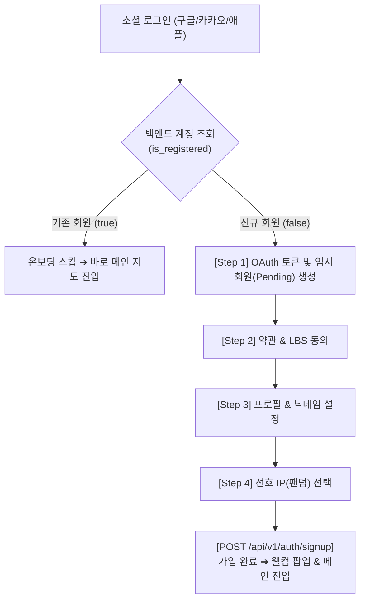

# 팬덤 땅따먹기 상세기획 — 온보딩 & 로그인 (Onboarding & Auth)

> 본 문서는 [fandom_핵심정책_v0.1_20260722.md](file:///Users/jmk/develop/fandom-conquest/docs/01_planning/01_overview/fandom_핵심정책_v0.1_20260722.md) 및 [fandom_기능명세_v0.1_20260722.md](file:///Users/jmk/develop/fandom-conquest/docs/01_planning/01_overview/fandom_기능명세_v0.1_20260722.md)를 바탕으로 **회원가입, 로그인, 게스트 접근 권한 및 온보딩 세부 동작**을 정의한다.
> 
> 🔗 **소셜 OAuth 개발 연동 및 백엔드/프론트엔드 API 규격 명세**: [fandom_기술명세_소셜_OAuth_연동가이드_v0.1_20260722.md](file:///Users/jmk/develop/fandom-conquest/docs/03_dev/fandom_기술명세_소셜_OAuth_연동가이드_v0.1_20260722.md) 참조.

---

## 1. 로그인 & 인증 수단 정책

### 1.1 소셜 OAuth 프로바이더
* **지원 프로바이더**: **구글(Google)**, **카카오(Kakao)**, **애플(Apple Sign-in)**
* **이메일/비밀번호 가입 미지원**: 소셜 OAuth 100% 전용 (이메일/비밀번호 자체 가입은 보안 및 어뷰징 방지를 위해 미지원하며, 확장 가능성은 [fandom_추후개선_로드맵_v0.1_20260722.md](file:///Users/jmk/develop/fandom-conquest/docs/01_planning/01_overview/fandom_추후개선_로드맵_v0.1_20260722.md) 참조).
* **본인인증 비의존**: 한국 휴대폰 SMS/PASS 본인인증에 의존하지 않음 ➔ 글로벌 유저(외국인 팬)의 진입 장벽 전면 제거.
* **1인 1계정 원칙**: 동일 소셜 계정당 1개 프로필 생성. 다계정을 통한 점수 조작은 4겹 어뷰징 방어 시스템(이상탐지 큐)에 의해 모니터링 및 제재.

### 1.2 게스트 (비회원) 접근 권한
* **조회 전용 제한 (Read-Only Preview)**:
  * `성지 지도 (Home Map View)`: 메인 지도 색상 점령 현황 원거리 보기 가능.
  * `성지 상세 / 랭킹 보드 / 영수증 인증`: 클릭 또는 세부 정보 접근 시 **로그인 유도 팝업/모달 즉시 강제 노출**.
* **회원 전환 CTA 트리거**:
  * `[영수증으로 인증하기]`, `[성지 상세 보기]`, `[랭킹 기여도 조회]` 클릭 시 ➔ 온보딩/로그인 모달 진입.

---

## 2. Step-by-Step 온보딩 및 회원가입 프로세스

유저가 최초 소셜 로그인 시 거치는 **4단계 온보딩 & 회원가입 플로우**입니다.

### 2.1 로그인 vs 신규 회원가입 분기 로직

### 2.2 단계별 상세 세부 동작

#### [Step 1] 소셜 로그인 (OAuth)
* 구글 / 카카오 / 애플 버튼 제공
* OAuth 인증 성공 시 백엔드 JWT 토큰 (Access Token / Refresh Token) 발급 및 신규/기존 회원 여부 판별.

#### [Step 2] 이용약관 및 서비스 동의
* **이용약관 동의 (필수)**: 서비스 표준 이용약관
* **개인정보 수집·이용 동의 (필수)**: 이메일, 프로필 정보 수집
* **위치기반서비스(LBS) 이용 약관 동의 (필수)**: GPS 대조 인증 및 지도 위치 제공에 필요한 법적 필수 동의
* **마케팅/푸시 알림 수신 동의 (선택)**: 점령 뒤집힘 알림 및 이벤트 소식 수신

#### [Step 3] 프로필 및 닉네임 설정
* **프로필 이미지**: 소셜 기본 프로필 이미지 자동 불러오기 또는 서비스 기본 캐릭터 프로필 4종 중 선택
* **닉네임 정책**:
  * **길이 제한**: 최소 2자 ~ 최대 12자 (한글, 영문, 숫자 허용)
  * **중복 검수**: 실시간 중복 체크 API 호출 (`[중복 확인]` 통과 필수)
  * **금지어 필터링**: 욕설/비속어, 타 팬덤 비하 단어, 엔터사/아티스트 공식 사칭 단어 금지 목록 대조
  * **특수문자**: 공백 및 특수문자 입력 불가 (언더바 `_` 만 허용)

#### [Step 4] 선호 IP (팬덤) 선택 및 예외 처리
* **기능**: 유저가 응원하는 엔터테인먼트 IP 팬덤 선택 (예: 뉴진스, 아이브, 세븐틴 등)
* **메인 팬덤 지정**: 선택한 팬덤 중 1개를 '대표 메인 팬덤'으로 지정 (성지 인증 시 기본 귀속 팬덤으로 자동 적용).
* **예외 처리 (원하는 IP가 없거나 나중에 정하고 싶은 경우)**:
  1. `[IP 직접 신청하기]`: 검색 결과 하단 버튼 클릭 ➔ 아티스트/IP명 직접 입력 후 신청 ➔ 유저는 `[기타/신청중]` 팬덤으로 가입 완료 (어드민 개설 검토 큐로 즉시 전송).
  2. `[나중에 선택하기 (무소속)]`: 특정 팬덤 미지정 상태로 가입 완료 ➔ `무소속/탐색 유저` 상태로 진입 (마이페이지에서 언제든 지정 가능).

---

## 3. 세션 관리 & 회원 탈퇴 정책

### 3.1 토큰 & 세션 정책
* **Access Token**: 2시간 유효 (Header Bearer 인증)
* **Refresh Token**: 14일 유효 (HttpOnly Cookie)
* **자동 로그인**: Refresh Token 유효 시 앱 재방문 시 자동 로그인 유지

### 3.2 회원 탈퇴 및 데이터 처리 (개인정보 vs 게임 데이터)
* **개인정보 즉시 파기**: 회원 탈퇴 즉시 유저 소셜 연동 ID, 이메일, 닉네임 등 식별 개인정보는 DB에서 완벽 파기/지움.
* **땅 점유 및 팬덤 집계 유지 (익명화)**:
  * 탈퇴한 유저가 과거에 수행했던 영수증 인증 건과 이에 의한 **구(區) 단위 땅 점유율/팬덤 점수는 익명화(Anonymous) 상태로 영구 유지**.
  * **사유**: 개인 탈퇴로 인해 땅 점유율이 갑자기 크게 감소하면 팬덤 간 점령전 게임성이 훼손되기 때문 (점수는 유저 개인 소유가 아닌 팬덤 집단 소유 개념).
* **랭킹 처리**: 개인 랭킹 보드에서는 탈퇴 계정이 즉시 제거됨.

