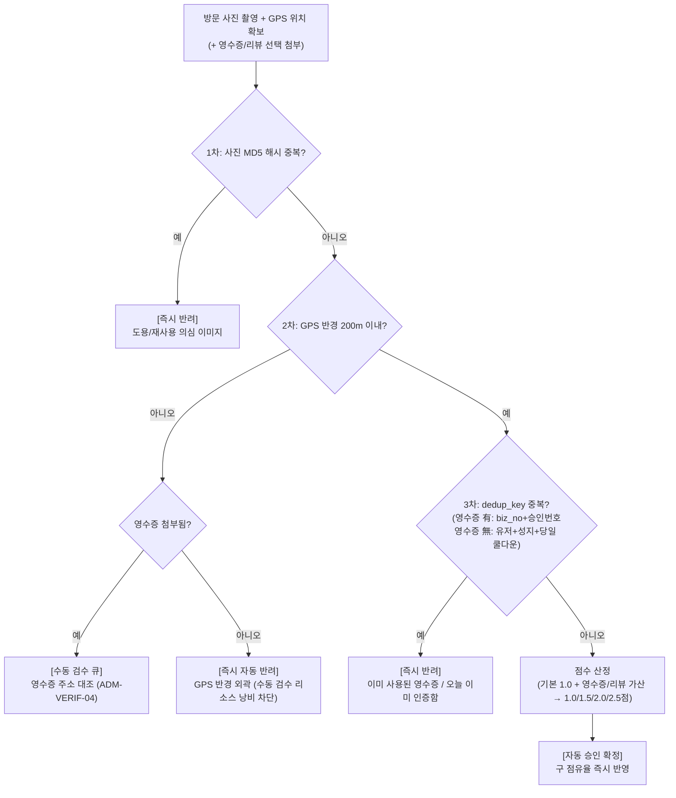
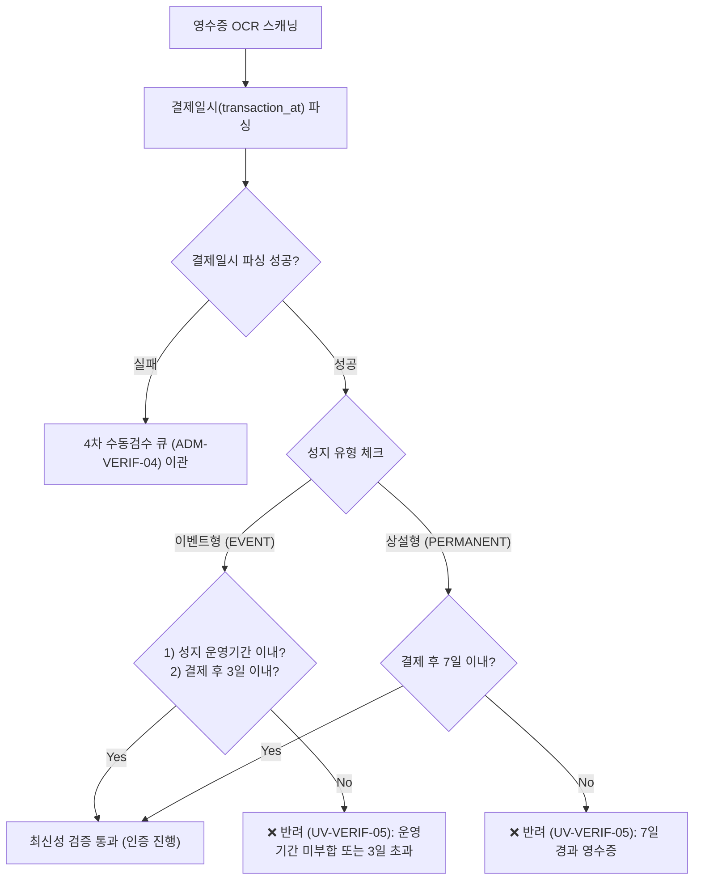

# 팬덤 땅따먹기 상세기획 — 인증 & 어뷰징 방어 (Verification & Anti-Abuse)

> **문서 버전**: v0.2
> **최종 수정일**: 2026-08-17
> **문서 상태**: Approved Spec
> 본 문서는 [fandom_핵심정책_v0.1_20260722.md](file:///Users/jmk/develop/fandom-conquest/docs/01_planning/01_overview/fandom_핵심정책_v0.1_20260722.md)의 인증(Verification) 메커니즘과 **4겹 어뷰징 방어 체계, OCR 추출 및 반려 메시지 기능 정의**를 다룬다.
> 🔄 **v0.2 반영**: [fandom_인증다변화_기획제안_v0.1_20260729.md](file:///Users/jmk/develop/fandom-conquest/docs/01_planning/03_discussion/fandom_인증다변화_기획제안_v0.1_20260729.md) 논의안 채택. 영수증 필수(가맹점 전용) 인증에서 **"GPS + 방문 사진" 필수 · 영수증/리뷰 가산 점수** 모델로 전환하여 사업자등록번호가 없는 비상업 성지(벽화, 야외 촬영지, 기념 공원, 조형물 등)도 포용.

---

## 1. 방문 인증 모델 & 점수 밸런스

방문 인증의 행동 단계에 따라 점수 가치를 차등화하여 유저의 참여 허들을 낮추고, 양질의 데이터 확보 및 소비 활성화를 유도합니다. **GPS 반경 200m 이내 + 방문 증빙 사진 1장 이상**은 모든 인증 조합의 공통 필수 조건이며, 영수증·리뷰는 가산 선택 항목입니다.

| 인증 조합 | 필수 항목 | 선택 항목 | 획득 점수 | 기획 및 밸런싱 근거 |
| :--- | :--- | :--- | :---: | :--- |
| **① 기본 방문 인증** | 실시간 GPS 반경 200m 이내 + 방문 증빙 사진 1장 이상 | - | **1.0점** | 성지 현장에 실제로 도달하여 인증한 행동에 대한 기본 점수 |
| **② 소비 촉진 인증** | 실시간 GPS 반경 200m 이내 + 방문 증빙 사진 1장 이상 | **영수증 이미지 추가** (OCR) | **2.0점** | 상업 매장에서의 실제 소비 행위를 증명하므로 기본 점수의 2배 가치 부여 |
| **③ 정보 공유 인증** | 실시간 GPS 반경 200m 이내 + 방문 증빙 사진 1장 이상 | **리뷰 문구 추가** (최소 10자 이상) | **1.5점** | 성지 방문 후기 공유를 통한 서비스 내 정보 활성화 기여 반영 |
| **④ 복합 완결 인증** | 실시간 GPS 반경 200m 이내 + 방문 증빙 사진 1장 이상 | **영수증 및 리뷰 모두 추가** | **2.5점** | 현장 도달 + 소비 촉진 + 정보 공유의 모든 유저 액션에 대한 최대 리워드 |

> ⚠️ 점수 수치(1.0/1.5/2.0/2.5) 및 인플레이션 밸런싱은 §5 미결 안건 참조 — 출시 전 시뮬레이션 확정 필요.
> 점수는 [fandom_상세기획_팬덤_땅점령_v0.2_20260817.md](file:///Users/jmk/develop/fandom-conquest/docs/01_planning/02_detail/02_user_view/fandom_상세기획_팬덤_땅점령_v0.2_20260817.md) §3의 14일 롤링 감쇠 공식에 베이스 점수로 대입된다.

---

## 2. GPS + 사진 기본 인증 파이프라인

유저가 성지에서 GPS 위치와 방문 사진을 제출 시 실행되는 단계별 인증 프로세스입니다. 영수증/리뷰 가산 항목이 있는 경우 점수 산정 단계에서 합산됩니다.

### 2.1 AI OCR 4개 추출 필드 (영수증 가산 인증 시 · 선택)
영수증을 추가로 첨부한 **② 소비 촉진 인증 / ④ 복합 완결 인증**에서만 실행되는 OCR 판독입니다.
1. **사업자등록번호 (Business Registration No)**: 10자리 숫자 (성지 장소 일치 대조용)
2. **거래일시 (Transaction Datetime)**: YYYY-MM-DD HH:mm:ss (최신성 및 운영기간 검증용)
3. **결제금액 (Total Amount)**: KRW 결제 금액
4. **승인번호 (Approval No)**: 카드/현금영수증 승인번호 8~12자리 (고유 중복 차단키)

---

### 2.2 영수증 최신성(Freshness) 유효기간 정책 & 백엔드 자동 검증 플로우 (영수증 가산 인증 시)

실시간 현장 점령전의 게임성을 보장하고 오래된 영수증 모아 올리기/도용 어뷰징을 차단하기 위해 **영수증 결제일시의 최신성 검증**을 100% 실행합니다.

* **이벤트형 성지 (`EVENT`)**: 결제일시가 **성지 공식 운영기간 이내**이어야 하며, **결제 시각 기준 최근 3일 이내 (72시간 이내)** 제출건만 인정.
* **상설형 성지 (`PERMANENT`)**: 결제 시각 기준 **최근 7일 이내 (168시간 이내)** 영수증만 인정.

---

## 3. 5겹 어뷰징 방어 상세 규격

> ✨(v0.2) 영수증 필수 모델 시절의 "승인번호 유니크 키" 1차 방어를 **이미지 해시 대조**로 교체하고, 영수증 유무에 따라 dedup 로직을 이원화했습니다.

### 3.1 1차 방어: 방문 사진 MD5 해시 대조 (Image Dedup)
* **`photo_hash` 규칙**: 제출된 방문 사진 파일의 MD5 해시를 계산하여 기존 제출 이력과 대조.
* **목적**: 웹에서 다운로드한 사진, 타인 사진 재업로드 등 이미지 도용 어뷰징을 근본 차단.

### 3.2 2차 방어: GPS 반경 대조 (Location Verification)
* **반경 규격**: 성지 지점 기준 **반경 200m 이내** 유저 위치 확인.
* **유연한 처리**: 반경 밖에서 업로드 시 즉시 하드 반려하지 않고, **영수증이 첨부된 경우에 한해** `플래그(Flag)` 처리 후 어드민 **수동 검수 큐**로 전달 (통신 장애/매장 내부 GPS 오차 유저 포용). 영수증이 없으면 검수 리소스 낭비를 막기 위해 **즉시 자동 반려**.

### 3.3 3차 방어: 이원화 Dedup Key & 쿨다운
* **영수증 有 (`dedup_key = biz_no + approval_no`)**: 동일 영수증 재촬영/재사용을 DB Unique 인덱스로 근본 차단.
* **영수증 無 (`dedup_key = user_id + spot_id + date(created_at)`)**: 유저 1인당 동일 성지 **1일 1회 인증 제한**을 DB 유니크 제약으로 강제 (자정 KST 기준 리셋).
* **건수 기반 고정 배점 유지**: 영수증 결제 금액과 무관하게 인증 조합(§1)에 따른 고정 점수만 부여 ➔ 소액 결제 반복 펌핑 행위 무효화.

### 3.4 4차 방어: 이상탐지 수동 검수 큐 (Anomaly Detection)
* 단시간 내 특정 매장 인증 건수 이상 급증, 동일 IP 다계정 접근 탐지 시 자동 승인 즉시 보류 및 어드민 수동 검수 큐 이관.

### 3.5 5차 방어: 리뷰 텍스트 유효성 필터 (Review Spam Guard)
* 리뷰 가산 인증(③/④) 제출 시 [공통 금칙어 관리(`ADM-SYSTEM-01`)](file:///Users/jmk/develop/fandom-conquest/docs/01_planning/02_detail/03_admin/fandom_상세기획_어드민_공통_금칙어_v0.2_20260723.md) 엔진을 재사용하여 최소 글자 수 및 무의미 반복 문자(`ㅇㅇㅇㅇㅇㅇ` 등) 도배를 필터링.
* ⚠️ 정확한 판정 규칙(최소 글자 수 임계값, 반복 문자 탐지 알고리즘)은 **§7 미결 안건** 참조 — 확정 전까지는 최소 10자 이상 여부만 1차 검증.

---

## 4. 인증 결과 처리 및 에러 UX 메시지 명세

### 4.1 결과 판정 및 피드백 UX

| 판정 상태 | 시스템 처리 | 유저 UI 피드백 토스트/팝업 메시지 |
| :--- | :--- | :--- |
| **자동 승인** | 점유율 즉시 반영, 획득 점수(1.0~2.5점) 표시 | 🎉 **"인증 완료! [마포구] [뉴진스] 점유율이 +0.4% 상승했습니다! (+2.0점 획득)"** |
| **수동 검수 이관** | 어드민 검수 대기 | ⏳ **"인증 판독 중입니다. 관리자 확인 후 10분 내에 처리됩니다."** |
| **이미지 도용 반려** | Hard Reject | ⚠️ **"이미 사용된 사진입니다. 직접 촬영한 사진으로 다시 시도해 주세요."** |
| **중복 반려** | Hard Reject | ⚠️ **"이미 인증에 사용된 영수증입니다."** |
| **최신성 만료** | Hard Reject | ⚠️ **"유효기간(이벤트 3일 / 상설 7일)이 지난 영수증입니다."** |
| **쿨다운 반려** | Hard Reject | ⏳ **"해당 성지는 오늘 이미 인증하셨습니다. 내일 다시 시도해 주세요!"** |
| **GPS 외곽 반려(영수증 無)**| Hard Reject | ❌ **"성지 반경(200m) 밖입니다. 현장에서 다시 시도해 주세요."** |
| **사업자 미일치**| Hard Reject / 재촬영 안내 | ❌ **"해당 성지의 영수증이 아닙니다. (사업자등록번호 미일치)"** |
| **OCR 스캔 실패**| 수동 검수 이관 | 📸 **"영수증 글자가 구겨지거나 흐릿합니다. 선명하게 다시 찍어주세요."** |
| **리뷰 필터 반려**| Hard Reject / 재작성 안내 | ✏️ **"유효하지 않은 리뷰입니다. 최소 10자 이상 방문 후기를 작성해 주세요."** |

---

## 5. 개인정보 보호 & 마스킹 처리

* **영수증 원본 이미지 파기**: OCR 필요 필드(사업자번호, 일시, 금액, 승인번호) 파싱이 완료되면 영수증 원본 이미지에서 마스킹(카드번호 일부 제거) 처리 후 **최대 7일 내 원본 파기**.
* **데이터 저장 최소화**: 개인 신용카드 정보는 절대 저장하지 않음.

---

## 6. 카메라 촬영 가이드 UX & 권한 예외 처리

### 6.1 촬영 가이드 UX (Camera Overlay)
* **방문 사진 촬영**: 성지 현장(간판, 조형물, 포토존 등)이 식별 가능하도록 안내 문구 노출 ("성지가 잘 보이도록 사진을 찍어주세요").
* **영수증 가산 촬영 시 뷰파인더 오버레이**: 영수증 직사각형 가이드 프레임 제공 ("영수증을 사각형 프레임 안에 평평하게 정렬해 주세요").
* **환경 안내 메시지**: 
  * "어두운 곳에서는 밝은 조명 아래에서 찍어주세요."
  * "영수증의 승인번호와 사업자번호가 잘 보이도록 펼쳐주세요."

### 6.2 카메라 및 위치 권한 거부 시 예외 UX
* **카메라 권한 거부 시**: `[권한 필요]` 모달 팝업 ➔ *"방문 인증 사진 촬영을 위해 카메라 접근 권한이 필요합니다. [디바이스 설정으로 이동]"* 안내.
* **위치(GPS) 권한 거부 시**: 위치 정보 미제공 시 인증 제출 불가능 ➔ *"성지 반경 확인을 위해 위치 서비스 권한을 허용해 주세요"* 안내.

---

## 7. 미결 안건 (Open Agenda — 논의 중)

> [fandom_인증다변화_기획제안_v0.1_20260729.md](file:///Users/jmk/develop/fandom-conquest/docs/01_planning/03_discussion/fandom_인증다변화_기획제안_v0.1_20260729.md) §4에서 제기된 안건 중 아직 확정되지 않은 항목입니다. 확정 전까지 위 스펙(§1~6)은 잠정치로 취급합니다.

1. **점수 가산 수치(1.0 / 1.5 / 2.0 / 2.5)의 시뮬레이션 및 적절성**: 점령전 점수 인플레이션 가능성 검토 및 밸런스 조정 필요 여부.
2. **사진 인증 자동 검수(AI 필터링) 도입 여부**: 초기 수동 검수 의존 → 장기적으로 사진의 성지 정합성(랜드마크/매장 간판 판독) 자동화 방안 검토.
3. **리뷰 최소 글자 수 및 금칙어 기준**: 무의미한 텍스트 도배 필터링 스펙(§3.5) 최종 확정 필요.

