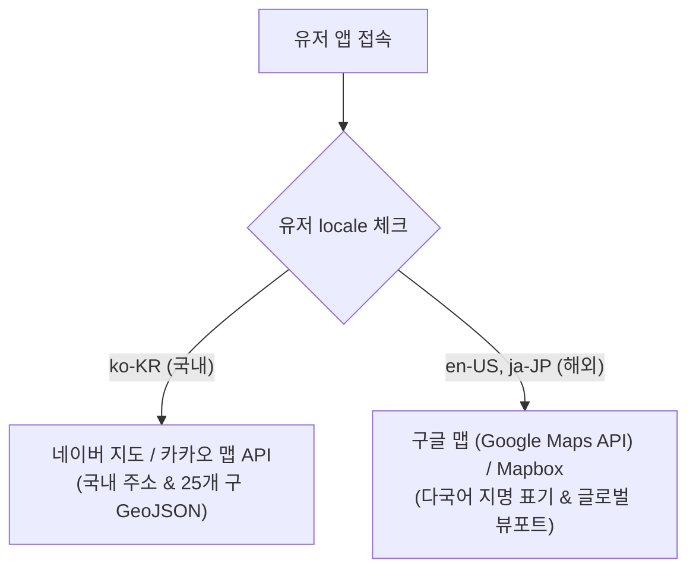

# 팬덤 땅따먹기 상세기획 — 지도 · LBS · 장소 & 성지 (Map, LBS, Place & Spot)

> 본 문서는 [fandom_핵심정책_v0.1_20260722.md](file:///Users/jmk/develop/fandom-conquest/docs/01_planning/01_overview/fandom_핵심정책_v0.1_20260722.md)의 장소·성지·지도 도메인을 전제로, **지도 엔진 연동, LBS 위치 서비스 승인/권한 정책, GeoJSON 점령 시각화, 장소·성지 세부 규격 및 UI 동작**을 종합 통합하여 명세한다.

---

## 1. 위치 서비스(LBS) 승인 & 디바이스 권한 정책

위치 기반(LBS) 서비스의 특성상 유저의 GPS 위치 권한 승인 여부에 따른 명확한 제어 및 가이드 UX를 정의한다.

### 1.1 위치 권한 동의 및 승인 절차 (Permission Flow)
1. **[Step 1] 온보딩 LBS 약관 동의 (필수)**: 회원가입 시 위치기반서비스 이용약관 동의 (법적 필수 동의).
2. **[Step 2] 디바이스 위치 권한 (GPS) 승인 팝업**: 메인 지도 진입 시 브라우저/OS 표준 위치 권한 허용 팝업 호출 (`"팬덤 땅따먹기에서 내 위치 주변 성지 탐색 및 영수증 인증을 위해 위치 권한을 사용합니다"`).

### 1.2 권한 상태별 시스템 동작 & 예외 UX

| 위치 권한 상태 | 시스템 동작 및 지도 렌더링 | 영수증 인증 클릭 시 동작 |
| :--- | :--- | :--- |
| **`허용 (Granted)`** | • 내 위치 블루 마커 핀 표시 • `[내 위치로 이동]` FAB 버튼 활성화 • 현재 뷰포트 주변 성지 바텀시트 자동 갱신 | 정상 진행 (내 위치 기준 반경 200m 이내 성지 인증) |
| **`거부 (Denied)`** | • 기본 핫스팟 (예: 홍대입구역/서울시청) 뷰포트 고정 • 내 위치 마커 비활성화 • 지도 탐색/전황 조회의 **Read-Only 기능은 정상 유지** | ⚠️ **`[위치 서비스 승인 필요]` 모달 팝업** ➔ *"위치 권한이 필요합니다. 디바이스 설정에서 위치 서비스를 허용해 주세요."* ➔ `[설정으로 이동]` 버튼 제공 |

---

## 2. 지도 프로바이더 하이브리드 연동 전략

글로벌 팬덤 유저와 국내 유저를 모두 포용하기 위해 유저 `locale`에 따른 지도 SDK 분기 연동을 적용한다.

* **국내 유저 (`ko-KR`)**: **네이버 지도(Naver Maps JavaScript API v3) / 카카오 맵 API**
  * **채택 사유**: 한국 지번/도로명 주소의 높은 검색 정확도, 서울시 25개 구(區) 행정경계 GeoJSON 데이터 완벽 매핑.
* **외국인 유저 (`en-US`, `ja-JP`, `zh-CN` 등)**: **구글 맵(Google Maps API) / Mapbox Vector Tile**
  * **채택 사유**: 해외 IP 및 다국어 지명(English/Japanese) 표시 지원, 글로벌 포용성 확보.

---

## 3. GeoJSON 점령 시각화 & LBS 기술 명세

### 3.1 구(區) 단위 GeoJSON 폴리곤 점령 시각화
* **행정구역 데이터**: 서울시 25개 구 경계 위경도 좌표 데이터 (`seoul_districts.geojson`) 연동.
* **1위 팬덤 색상 채색 (Fill Polygon)**:
  * 구 내부 점유율 1위 팬덤이 **40% 이상 단독 1위**일 경우 해당 팬덤의 대표 Hex 컬러로 폴리곤 면 채색.
  * **투명도(Opacity)**: `fillOpacity: 0.4`, `strokeWeight: 2px` (지적 배경 및 도로망 가독성 보장).
  * **무주공산/경합**: 40% 미만 미달 시 `fillOpacity: 0` (투명/중립 표시), 1위 팬덤 점유율 35% 이상 시 연한 점선 테두리 표시.

### 3.2 BBOX (Bounding Box) Spatial Query
* **목적**: 지도 이동 시 전국의 모든 성지를 한 번에 가져오는 성능 과부하를 방지.
* **백엔드 쿼리**: 유저의 현재 지도 화면 바운딩 박스 (`min_lat`, `min_lng`, `max_lat`, `max_lng`) 범위 내의 성지 핀만 백엔드 Spatial Index (`PostGIS / Turf.js`)를 이용하여 즉시 경량화 조회.

### 3.3 줌 레벨별 마커 클러스터링 (Pin Clustering)
* **줌 레벨 1 ~ 12 (광역 뷰)**: 성지 핀이 밀집한 구역은 숫자가 표시된 `[클러스터 마커 (예: 12)]`로 자동 그룹화.
* **줌 레벨 13 ~ 18 (상세 뷰)**: 개별 성지 마커 핀으로 분리 확대 노출.

---

## 4. 장소(Place) & 성지(Spot) 세부 규격 및 UI 명세

### 4.1 장소(Place) 식별 및 상태전이
* **유일키**: **사업자등록번호 (10자리)**. 상호나 주소가 변경되어도 사업자번호 동일 시 **동일 장소**.
* **상태 전이**: 폐업/양도 시 과거 점유 이력 보존을 위해 삭제 없이 `status = CLOSED` 처리.

### 4.2 성지(Spot) 인정 커트라인 및 유형
1. **이벤트형 성지 (`EVENT`)**: 생일카페/팝업스토어 등 운영기간 지정 성지. 종료일 자정 후 자동 `ARCHIVED` 처리.
2. **상설형 성지 (`PERMANENT`)**: 단골집/촬영지 등 상시 거점. 최근 14일 롤링 감쇠 적용.
3. **인정 조건**: 결제 영수증(사업자번호) 발행 매장 필수 + 팬덤 맥락 존재.

### 4.3 화면별 UI 기능 명세

#### [화면 1] 성지 지도 (Home Map View)
* **지도 뷰포트**: 구별 점령 폴리곤, 성지 마커(이벤트형 `D-Day 뱃지`, 상설형 핀 구분).
* **필터바**: `[내 선호 IP만 보기]` 토글, `[구 선택 드롭다운]`.
* **바텀시트**: 스와이프 업 ➔ 현재 화면 바운딩 박스 내 `[주변 인기 성지 리스트]` 거리순/마감임박순 노출.

#### [화면 2] 성지 상세 모달 (Spot Detail Modal)
* **헤더**: 장소 상호, 성지 이벤트명, 운영기간(D-Day), 주소.
* **점유 현황**: 팬덤별 점유율 Progress Bar (예: 뉴진스 60% vs 아이브 40%).
* **인증 CTA**: **`[영수증으로 인증하고 땅 점령하기]`** (위치 권한 미허용 시 승인 안내 모달 유도).

---

## 5. UI 예외 상태 처리 명세 (Exception States)

* **Empty State (성지 없음)**: 검색 필터 적용 시 주변 뷰포트에 성지가 없을 경우 바텀시트에 *"이 구역에는 아직 등록된 성지가 없습니다"* 안내 및 `[성지 제보하기]` CTA 노출.
* **Network Error State**: 지도 타일 로딩 실패 시 *"네트워크 연결이 불안정합니다"* 토스트 및 `[새로고침]` 버튼 노출.
