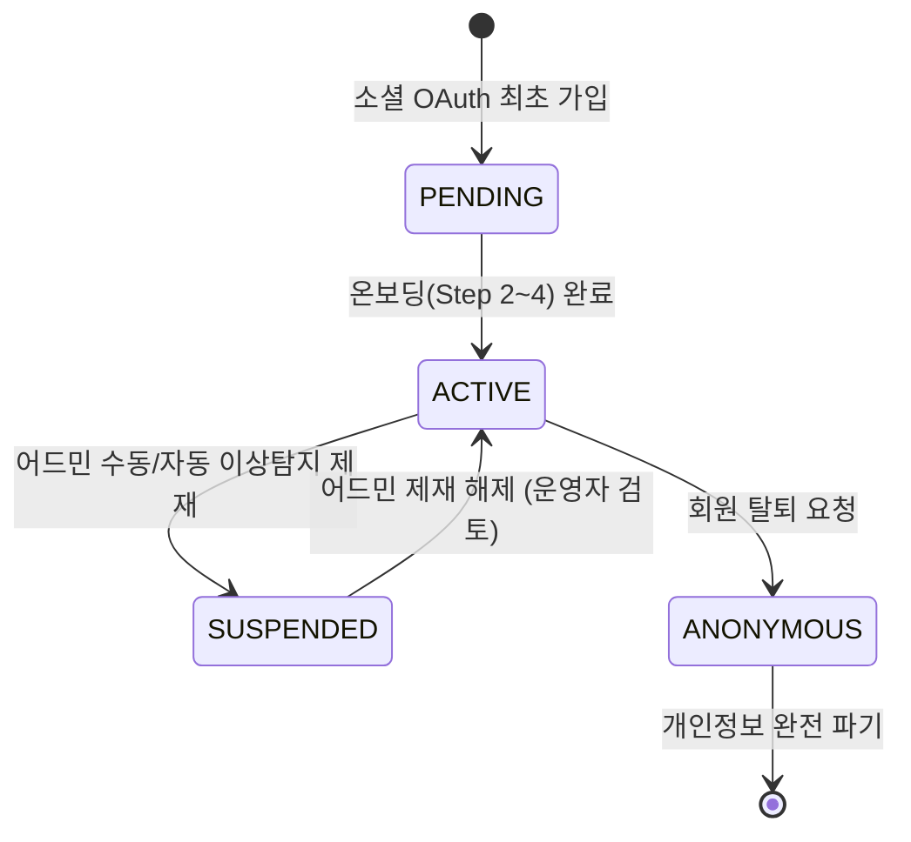

# 팬덤 땅따먹기 상세기획 — 팬 & 유저 (Fan & User Specification)

> 본 문서는 [fandom_핵심정책_v0.1_20260722.md](file:///Users/jmk/develop/fandom-conquest/docs/01_planning/01_overview/fandom_핵심정책_v0.1_20260722.md)의 팬(User) 도메인 규칙을 바탕으로 **유저 계정 라이프사이클, 블랙회원 자동/수동 제재 규격, 7일 팬덤 이적 쿨다운, 5대 게이밍 뱃지/칭호 체계, 개인 기여도 모달(`UV-RANK-02`) 및 탈퇴 데이터 익명화**를 촘촘히 명세한다.

---

## 1. 팬(User) 계정 상태 & 라이프사이클 (Account Lifecycle)



| 계정 상태 | 정의 | 주요 시스템 제약 및 행동 가능 범위 |
| :--- | :--- | :--- |
| **`PENDING`** | OAuth 인증 성공 후 온보딩(Step 2~4) 미완료 상태 | • 메인 지도 원거리 조회만 가능<br>• 영수증 인증 및 랭킹 기여 불가능 (온보딩 모달 유도) |
| **`ACTIVE`** | 정식 가입 완료 유저 (메인 팬덤 보유 or 무소속/신청중) | • 모든 기능 (영수증 인증, 랭킹 기여, 성지 제보, 마이페이지) 정상 이용 |
| **`SUSPENDED`** | 어뷰징/다계정/중복 영수증 도용으로 제재된 블랙회원 | • 서비스 접근 차단 팝업 ➔ *"어뷰징 방지 정책에 의해 활동이 정지된 계정입니다."* |
| **`ANONYMOUS`** | 회원 탈퇴를 완료한 익명 유저 | • 개인 식별 정보(이메일, 닉네임, 소셜ID) **즉시 완전 파기**<br>• 과거 영수증 인증 점수는 `ANONYMOUS_USER`로 **익명 보존** |

---

## 2. 블랙회원 (`SUSPENDED`) 제재 및 어드민 운영 처리 규격

어뷰징 유저 차단을 위해 **자동 선처리(시스템 자동 임시 정지)**와 **운영자 수동 차단** 2가지 모드를 제공합니다.

### 2.1 자동 선처리 및 어드민 확정 (System Auto-Suspension)
* **발생 조건**:
  * 동일 디바이스/IP에서 24시간 내 다계정(3개 이상)으로 영수증 제출 시.
  * 동일 승인번호 중복 영수증을 연속 3회 이상 악의적 업로드 시.
* **시스템 자동 동작**: 계정 상태를 **`SUSPENDED (임시 정지)`**로 즉시 자동 변경 ➔ 해당 유저의 미승인 영수증 홀딩 ➔ 어드민 이상탐지 검수 큐(`ADM-USER-02`)에 자동 적재.
* **운영자 검토 및 확정**: 운영자가 어드민에서 사유 확인 후 **`[정식 차단 확정]`** 또는 **`[오탐지 제재 해제 (ACTIVE 복구)]`** 결정.

### 2.2 운영자 수동 차단 (Manual Blacklist)
* **어드민 회원 관리 (`ADM-USER-01`)**: 특정 유저의 인증 로그 및 어뷰징 리포트를 조회하여 운영자가 직접 `[블랙회원 등록]` 버튼 클릭 시 즉시 `SUSPENDED` 상태 적용.

---

## 3. 팬덤 귀속 & 이적(선호 팬덤 변경) 7일 쿨다운 정책

### 3.1 자율적 팬덤 귀속 & 1인 다중 팬덤
* **증명 절차 없음**: 팬클럽 카드나 스트리밍 내역 등 무거운 증명 절차 없이 **자기 신고제**로 누구나 참여.
* **1인 다중 팬덤**: 선호 팬덤 목록에 여러 IP를 등록할 수 있으며, 영수증 인증 순간 원하는 귀속 팬덤 선택 가능.

### 3.2 대표 메인 팬덤 이적 쿨다운 (7일 쿨다운)
* **어뷰징 방지 목적**: 구(區) 단위 영토 점령전 막판에 타 팬덤으로 집단 이적하여 지도를 고의 교란하는 행위 차단.
* **7일 쿨다운 규격**:
  * 대표 메인 팬덤 변경 저장 시 **7일간 재변경 불가** 쿨다운 타이머 세팅 (`next_fandom_change_available_at`).
  * 마이페이지 선호 팬덤 수정(`UV-MY-02`) 진입 시 쿨다운 남은 시간 안내 (예: *"메인 팬덤 변경 후 5일 뒤 재변경 가능합니다"*).

### 3.3 과거 점수 소급 불가 원칙 (Strict Immutability)
* 메인 팬덤을 A그룹에서 B그룹으로 변경하더라도, **과거 A그룹 이름으로 인증했던 점수(+0.X%)와 지분율은 100% A그룹에 영구 보존**.
* 변경 이후 수행하는 새 영수증 인증 건부터 B그룹 점수로 귀속.

---

## 4. 뱃지 & 칭호 게이밍 체계 명세 (Badge & Title System)

유저의 영토전 활약에 따른 5대 뱃지 및 프로필 칭호 시스템입니다.

| 뱃지 ID | 뱃지명 | 프로필 칭호 | 획득 및 유지 조건 명세 | 시각적 혜택 |
| :--- | :--- | :--- | :--- | :--- |
| `BADGE-01` | **[구] 수호신** | **`마포구 수호신`** | 특정 구(區)에서 주간(월~일) 인증 건수 개인 1위 달성 시 (매주 월요일 자정 갱신) | • 프로필 닉네임 옆 👑 금빛 수호신 뱃지<br>• 성지 상세 탭 1 상단 포디움 1위 노출 |
| `BADGE-02` | **영토 개척자** | **`성동구 개척자`** | 점령되지 않은 미주공산/중립 구(區)에 팬덤 최초 인증 성공 시 | • 은빛 깃발 개척자 뱃지 |
| `BADGE-03` | **역전의 주역** | **`역전의 주역`** | 내 인증 1건으로 구(區) 1위 점령 팬덤이 뒤집히는 순간 기여 시 | • 붉은 불꽃 역전 뱃지 |
| `BADGE-04` | **성지 순례자** | **`성지 순례자`** | 서로 다른 오프라인 성지 5곳 이상 영수증 인증 승인 시 | • 지도 핀 순례자 뱃지 |
| `BADGE-05` | **열혈 덕후** | **`7일 연속 인증`** | 7일 연속으로 영수증 인증 성공 시 | • 7일 연속 리본 뱃지 |

---

## 5. 개인 기여도 상세 모달 (`UV-RANK-02`) UI 명세

유저가 랭킹 보드(`UV-RANK-01`)에서 특정 유저나 내 계정을 클릭했을 때 뜨는 상세 기여도 모달 명세입니다.

```
+-------------------------------------------------------------+
|  [ ✕ 닫기 ]                    개인 기여도 상세             |
+-------------------------------------------------------------+
|  👤 [프로필 사진]   덕질마스터 👑 [마포구 수호신 뱃지]        |
|  💙 메인 팬덤: 뉴진스 (NewJeans)   | 가입 D+45일            |
+-------------------------------------------------------------+
|  📊 [ 전체 누적 성적 ]                                       |
|  • 총 영수증 인증 횟수: 42건 (전체 개인 랭킹 12위)          |
|  • 보유 수호신 칭호: 2개 (마포구, 성동구)                    |
+-------------------------------------------------------------+
|  🗺️ [ 주요 구(區)별 우리 팬덤 기여 지분율 ]                  |
|  1. 🥇 마포구 (점유 점수 150점 중 내 기여 25점 · 지분율 16.6%) |
|     ■■■■■■■■■■□□□□□□□□□□ (팬덤 내 기여 1위)               |
|  2. 🥈 성동구 (점유 점수 80점 중 내 기여 10점 · 지분율 12.5%)  |
|     ■■■■■□□□□□□□□□□□□□□□ (팬덤 내 기여 2위)               |
+-------------------------------------------------------------+
|  🏆 [ 획득 뱃지 수집함 (4/5) ]                               |
|  [👑 마포구 수호신]  [🛡️ 영토 개척자]  [🔥 역전의주역]  [📍 순례자] |
+-------------------------------------------------------------+
```

---

## 6. 회원 탈퇴 시 개인정보 파기 vs 게임 데이터 익명화 명세

* **개인 식별 정보 즉시 완전 파기**: 소셜 OAuth 연동 ID, 이메일, 닉네임, 프로필 사진 URL, 디바이스 푸시 토큰, LBS 수신 동의 이력 파기.
* **게임 점유율 데이터 익명 보존**: 과거 영수증 인증 로그, 구(區) 단위 팬덤 점유율 점수는 유저 ID를 `ANONYMOUS_USER`로 익명 처리하여 영구 보존.
