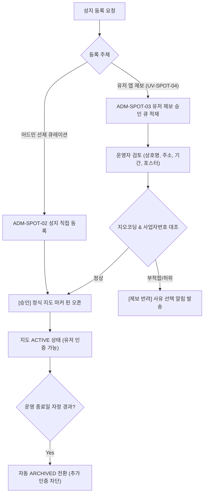

# 팬덤 땅따먹기 상세기획 — 어드민 거점 & 성지 관리 (Spot Master & User Proposal Queue)

> 본 문서는 [fandom_전체_정보구조도_IA_v0.1_20260722.md](file:///Users/jmk/develop/fandom-conquest/docs/01_planning/01_overview/fandom_전체_정보구조도_IA_v0.1_20260722.md)의 `8.0 Spot Master` 노드를 바탕으로 **장소 가맹점 관리(`ADM-SPOT-01`), 성지 핀 이벤트 관리(`ADM-SPOT-02`), 유저 제보 성지 승인 큐(`ADM-SPOT-03`) 및 성지 등록 운영 워크플로우(SOP 1)**를 정밀 명세한다.

---

## 1. [ADM-SPOT-01] 장소 가맹점 관리 (Place Master)

영수증 인증의 기준이 되는 물리적 사업자 등록 매장을 관리하고 폐업 상태를 제어하는 화면입니다.

* **입력 & 관리 필드**:
  * `사업자등록번호 (10자리)`: **필수 / Unique 검수** (인증 OCR 대조 키)
  * `상호명`, `도로명 주소`, `위도/경도 좌표` (주소 입력 시 카카오/구글 지오코딩 API 자동 연동)
  * `소속 구(Region)`: 좌표에 따른 행정구 자동 매핑 (예: `서울 마포구`)
  * `운영 상태`: `OPEN (정상)` / `CLOSED (폐업/양도)`
* **폐업(`CLOSED`) 처리 규칙**:
  * 폐업 처리 시 해당 매장의 지도 핀에 🔒 `[폐업/종료된 매장]` 뱃지 적용.
  * 유저 영수증 인증 시 ❌ **`[인증 불가: 폐업/종료된 매장입니다]`** 하드 차단 제어.

---

## 2. [ADM-SPOT-02] 성지 핀 이벤트 관리 (Spot Master)

지도상에 마커 핀으로 표시될 성지 이벤트를 생성하고 라이프사이클을 관리하는 화면입니다.

* **어드민 선제 큐레이션 등록**: 운영진이 주요 생일카페/팝업스토어 정보를 사전 생성.
* **입력 & 관리 필드**:
  * `연동 장소(Place)`: 사업자등록번호로 기존 장소 선택 매핑
  * `귀속 팬덤(Fandom)`: 대상 팬덤 IP 선택 (예: `NewJeans`)
  * `성지 타이틀`: 지도 및 모달에 표시될 이벤트명 (예: `하니 22번째 생일 팝업카페`)
  * `성지 유형`: `EVENT (이벤트형)` / `PERMANENT (상설 거점)`
  * `운영 기간`: 시작일 ~ 종료일 (`EVENT` 선택 시 필수, 종료 자정 후 자동 `ARCHIVED` 스케줄링)

---

## 3. [ADM-SPOT-03] 유저 제보 성지 승인 큐 (User Spot Proposal Queue)

유저가 앱에서 제보한 폼(`UV-SPOT-04`)을 검토하고 지도에 정식 마커로 노출시키는 검수 큐입니다.

```
+------------------------------------+------------------------------------+
|  [좌측: 유저 제보 입력 폼 내용]    |  [우측: 카카오/구글 지오코딩 대조] |
|  • 성지 유형: 이벤트형 (생카)      |  • 입력 주소: 마포구 독막로 123    |
|  • 귀속 팬덤: 뉴진스 (NewJeans)    |  • 지오코딩 위경도: 37.548, 126.921 |
|  • 성지/이벤트명: 하니 생일 팝업   |  • 소속 행정구: 서울 마포구        |
|  • 장소 상호: 카페 어반소스        |  • 사업자번호 대조: 123-45-67890   |
|  • 운영 기간: 2026.07.01 ~ 07.15   |                                    |
|  • 포스터 사진: [첨부 2장 보기]    |  [정식 성지 핀 등록 승인]          |
|  • 사업자번호: 123-45-67890        |  [제보 반려 (사유 선택)]           |
+------------------------------------+------------------------------------+
```

---

## 4. [플로우 1] 성지 등록 & 승인 라이프사이클 운영 프로세스 (Spot SOP)


