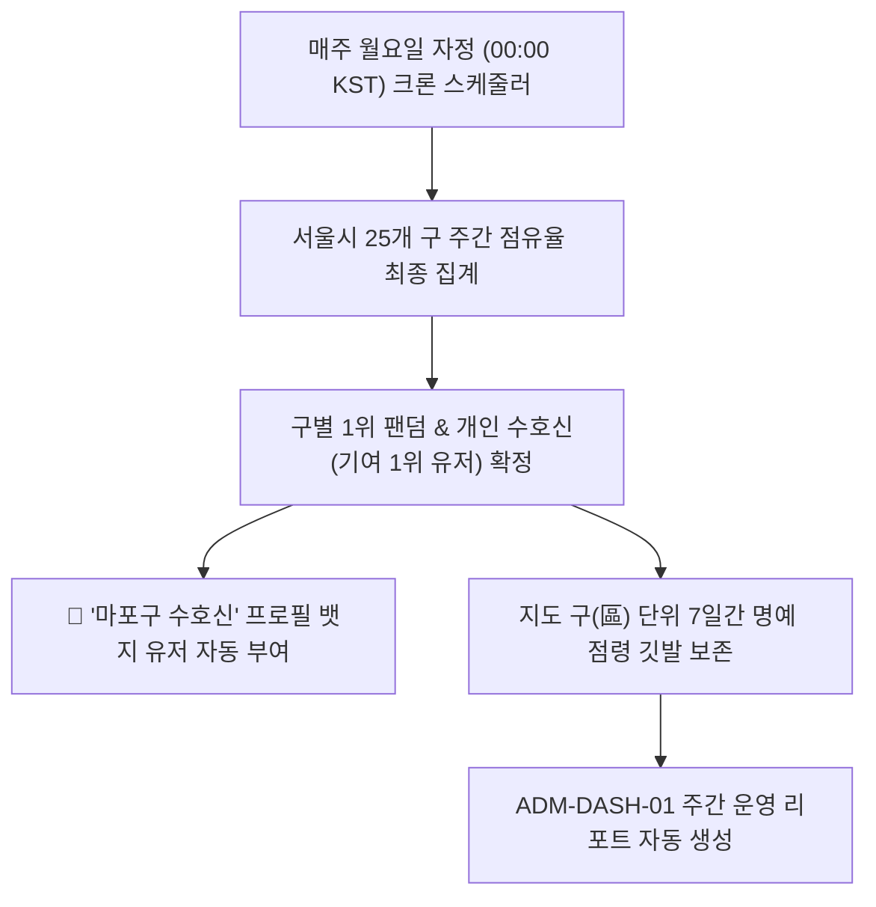

# 팬덤 땅따먹기 상세기획 — 어드민 시스템 & 계정 관리 (System Settings & Admin Accounts)

> 본 문서는 [fandom_전체_정보구조도_IA_v0.1_20260722.md](file:///Users/jmk/develop/fandom-conquest/docs/01_planning/01_overview/fandom_전체_정보구조도_IA_v0.1_20260722.md)의 `11.0 System Settings` 노드를 바탕으로 **팬덤 IP & 대표 컬러 관리(`ADM-SYS-01`), 어드민 계정 및 권한 관리(`ADM-SYS-02`) 및 주간 시즌 결산 스케줄링(SOP 4)**을 정밀 명세한다.

---

## 1. [ADM-SYS-01] 팬덤 IP & 대표 컬러 관리

서비스에 등록되는 팬덤 팀 정보와 지도 및 마커에 채색될 고유 Hex Color 토큰을 관리하는 화면입니다.

* **팬덤 IP 등록**: 팬덤 정식 명칭, 대표 아티스트, 다국어 이명/별칭 파싱 키워드 매핑 (예: `NewJeans`, `뉴진스`, `버니즈` ➔ 동일 ID 매핑).
* **Primary Hex Color 토큰**: 고유 점령 채색 컬러 지정 및 가시성 확보를 위한 4.5:1 대비(Contrast Ratio) 자동 검수.

---

## 2. [ADM-SYS-02] 어드민 계정 및 권한 관리 (Admin User Management)

외부 가입이 차단된 어드민 시스템에서 최고 관리자가 신규 백오피스 운영자 계정을 발급하고 권한을 부여하는 화면입니다.

```
+-------------------------------------------------------------+
|  [ ⚙️ 어드민 계정 관리 ]                  [ ➕ 신규 운영자 발급 ]|
+-------------------------------------------------------------+
|  등록된 백오피스 운영자 목록 (총 3명)                       |
|                                                             |
|  1. 👑 최고관리자 (admin@fandomconquest.com)                |
|     • 권한: 슈퍼 관리자  |  상태: 🟢 정상  |  2FA: 적용됨  |
|                                                             |
|  2. 👤 검수담당자 A (operator1@fandomconquest.com)          |
|     • 권한: 일반 운영자  |  상태: 🟢 정상  | [🔑 비번초기화] |
|                                                             |
|  3. 👤 검수담당자 B (operator2@fandomconquest.com)          |
|     • 권한: 일반 운영자  |  상태: 🔴 정지  | [🟢 계정활성]   |
+-------------------------------------------------------------+
```

### 2.1 신규 운영자 발급 모달 필드
1. `이메일 (아이디)`: 업무용 이메일
2. `운영자 실명`: 담당자 이름
3. `임시 비밀번호`: 최초 로그인 시 변경 필수
4. `권한 지정`: `[슈퍼 관리자]` (전체 권한) / `[일반 운영자]` (검수/성지 관리 권한)

---

## 3. [플로우 4] 주간 시즌 결산 및 명예 뱃지 부여 스케줄링 프로세스 (SOP 4)


