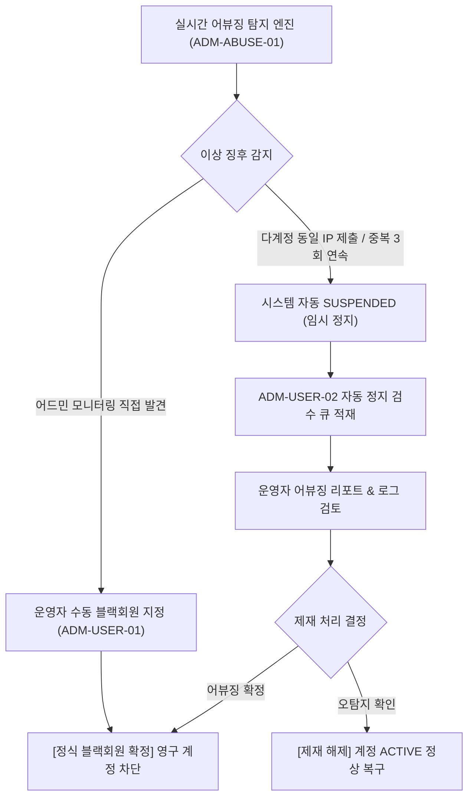

# 팬덤 땅따먹기 상세기획 — 어드민 어뷰징 탐지 & 유저 제재 (Anti-Abuse & User Management)

> 본 문서는 [fandom_전체_정보구조도_IA_v0.1_20260722.md](file:///Users/jmk/develop/fandom-conquest/docs/01_planning/01_overview/fandom_전체_정보구조도_IA_v0.1_20260722.md)의 `10.0 Anti-Abuse & Users` 노드를 바탕으로 **이상 탐지 모니터링(`ADM-ABUSE-01`), 유저 관리 및 수동 제재(`ADM-USER-01`), 자동 임시정지 검수 큐(`ADM-USER-02`) 및 블랙회원 제재 프로세스(SOP 3)**를 정밀 명세한다.

---

## 1. [ADM-ABUSE-01] 이상 탐지 모니터링 (Anomaly Monitoring)

다계정 조작, 동일 IP 집중 접속, 중복 영수증 재촬영 징후를 모니터링하는 화면입니다.

* **10분간 인증 급증 핫스팟 경고**: 특정 매장에서 10분 내 30건 이상 인증이 쏟아지는 경우 핫스팟 알람 노출.
* **동일 IP / 디바이스 다계정 탐지**: 단일 IP 주소에서 복수 유저 계정(3개 이상)으로 영수증 제출 시 **자동 임시정지(`SUSPENDED`)** 큐로 이관.

---

## 2. [ADM-USER-01 & 02] 유저 관리 및 블랙회원 제재

### 2.1 [ADM-USER-02] 자동 임시정지 검수 큐 (Auto-Suspension Queue)
* 시스템 이상탐지 엔진에 의해 자동 정지(`SUSPENDED`) 처리된 유저 큐.
* 운영자가 어뷰징 제출 로그 및 동일 IP 접속 내역 검토 후 **`[정식 블랙회원 확정]`** 또는 **`[오탐지 해제 (ACTIVE 복구)]`**.

### 2.2 [ADM-USER-01] 유저 목록 & 수동 제재 (Manual Blacklist)
* 유저 닉네임, 이메일, 가입일, 누적 인증 횟수, 계정 상태(`ACTIVE` / `SUSPENDED`) 조회 테이블.
* 어뷰징 정황 발견 시 운영자가 직접 **`[블랙회원 수동 지정]`** 버튼 클릭하여 즉시 계정 차단.

---

## 3. [플로우 3] 이상탐지 & 블랙회원 제재 프로세스 (Anti-Abuse SOP)

