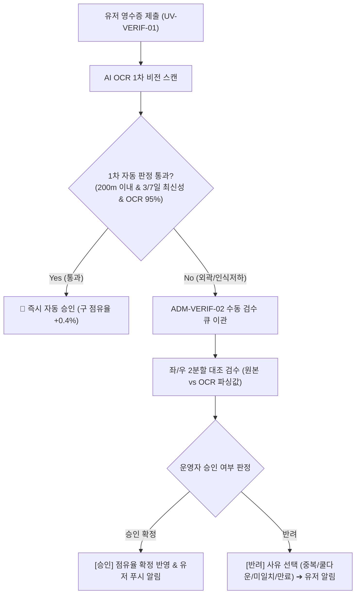

# 팬덤 땅따먹기 상세기획 — 어드민 영수증 인증 검수 OMS (Verification OMS Workflow)

> 본 문서는 [fandom_전체_정보구조도_IA_v0.1_20260722.md](file:///Users/jmk/develop/fandom-conquest/docs/01_planning/01_overview/fandom_전체_정보구조도_IA_v0.1_20260722.md)의 `9.0 Verification OMS` 노드를 바탕으로 **인증 내역 데이터 테이블(`ADM-VERIF-01`), 수동 검수 큐(`ADM-VERIF-02`), 반려 사유 관리(`ADM-VERIF-03`) 및 영수증 수동 검수 파이프라인(SOP 2)**을 정밀 명세한다.

---

## 1. [ADM-VERIF-01] 인증 내역 테이블

전체 접수된 영수증 인증 건을 주문관리시스템(OMS) 테이블로 조회하고 엑셀 추출을 제공하는 화면입니다.

* **4개 필터 탭**: `[전체 내역]` / `[자동 승인]` / `[수동 검수 큐 ⚠️]` / `[최종 반려]`
* **검색 & 필터**: 유저 닉네임, 사업자등록번호, 성지 상호명, 귀속 팬덤, 날짜 범위 검색.

---

## 2. [ADM-VERIF-02] 수동 검수 큐 워크플로우 (Manual Review Workflow)

위치 반경 200m 외곽 제출건, 결제일시 미인식건, 4차 플래그건을 **좌/우 2분할 대조 UI**로 빠른 수동 처리합니다.

```
+------------------------------------+------------------------------------+
|  [좌측: 제출 영수증 원본 이미지]   |  [우측: AI 판독값 & 검수 판정]    |
|                                    |  • 유저 닉네임: 덕질마스터         |
|   +----------------------------+   |  • 성지 장소명: 카페 어반소스      |
|   |  영수증 캡처/촬영 이미지  |   |  • 성지 사업자: 123-45-67890       |
|   |                            |   |  • OCR 읽은값: 123-45-67890 [일치] |
|   |  - 상호명: 어반소스        |   |  • 결제일시: 2026-07-22 14:20:00   |
|   |  - 사업자번호: 123-45-67890|   |  • 결제 최신성: 3일 이내 [통과]     |
|   |  - 승인번호: 87654321      |   |  • GPS 위치거리: 215m [수동확인]   |
|   +----------------------------+   |                                    |
|                                    |  [승인 확정 (+0.4%)]               |
|                                    |  [반려 (사유 선택)]                |
+------------------------------------+------------------------------------+
```

* **영수증 최신성 검수 기준**: 이벤트형 3일 이내 / 상설형 7일 이내 초과 시 `[최신성 만료 반려]` 사유 적용.

---

## 3. [ADM-VERIF-03] 반려 사유 프리셋 관리 (Rejection Presets)

반려 처리 시 유저에게 전송될 푸시 알림 및 에러 모달(`UV-VERIF-05`) 사유 템플릿 카드리스트 관리 화면입니다.

* **반려 사유 대표 템플릿**:
  1. `중복 영수증`: 이미 인증에 사용된 동일 승인번호 영수증
  2. `쿨다운 초과`: 오늘 해당 성지에 이미 인증을 마침
  3. `사업자 미일치`: 제출한 영수증의 매장 사업자번호와 성지 사업자번호 미일치
  4. `최신성 만료`: 결제 후 유효기간(이벤트형 3일 / 상설형 7일)이 초과된 영수증
  5. `판독 불가`: 글씨 구김/어두움으로 핵심 정보 파싱 불가능 (재촬영 유도)

---

## 4. [플로우 2] 영수증 수동 검수 파이프라인 프로세스 (Verification OMS SOP)


