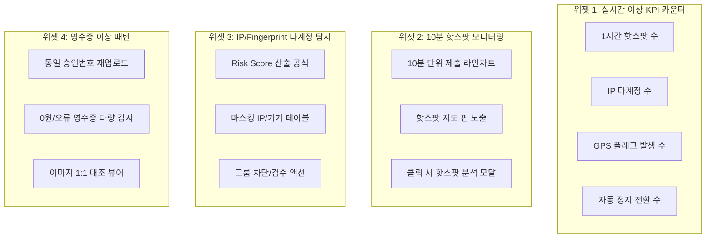
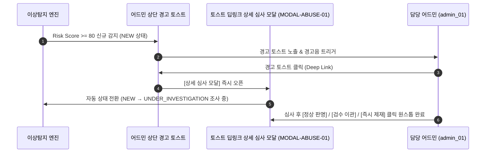

# 팬덤 땅따먹기 상세기획 — 어드민 어뷰징 탐지 모니터링 (v0.3)

> **문서 버전**: v0.3  
> **최종 수정일**: 2026-07-24  
> **문서 상태**: Approved Spec  
> **관련 화면 ID**: `ADM-ABUSE-01` (실시간 이상 징후 대시보드)  
> **관련 정책**: 4겹 어뷰징 방어 규칙 (`fandom_핵심정책_v0.1_20260722.md` #5)  
> **개발 API 참조**: [`docs/03_dev/api/admin_user_abuse_api_v0.1_20260724.md`](file:///Users/jmk/develop/fandom-conquest/docs/03_dev/api/admin_user_abuse_api_v0.1_20260724.md)

---

## 1. 개요 및 비즈니스 목적

본 문서는 '팬덤 땅따먹기' 서비스의 공정한 경쟁 환경을 보장하기 위한 **실시간 이상 징후 핫스팟 모니터링, 동일 IP / Device Fingerprint 다계정 탐지, 4겹 어뷰징 방어 감시 대시보드 (`ADM-ABUSE-01`)**와 **상세 심사/보류 모달 UI/UX, 경고 발송 채널, 보류 이관 후속 워크플로우 및 어드민 공통 모달 매핑**을 정밀 명세한다.

---

## 2. 대시보드 상단 실시간 컨트롤 & 필터바 명세

| 필터/컨트롤 항목 | 입력/선택 방식 | 선택지 / 규격 | 디폴트 값 (Default) |
| :--- | :--- | :--- | :--- |
| **실시간 자동 갱신** | Toggle + Dropdown | `OFF`, `10초`, `30초`, `1분` | `30초` (Auto Refresh) |
| **모니터링 대상 날짜**| Date Picker | 당일, 3일간, 7일간 | `당일 (Today)` |
| **위험도 레벨 필터** | Multi Select Dropdown | `전체`, `HIGH (Score>=80)`, `MEDIUM (Score>=50)`, `LOW` | `HIGH`, `MEDIUM` |
| **특정 성지 검색** | Text Input (AutoComplete)| 성지명, 성지 ID 검색 | `전체 성지` |
| **팬덤 필터** | Dropdown | 전체 팬덤, 특정 팬덤 목록 | `전체 팬덤` |

---

## 3. [ADM-ABUSE-01] 4대 모니터링 위젯 정밀 명세



---

### 3.1 [위젯 1] 실시간 이상 징후 KPI 카운터
- **4대 KPI 카드**: `1시간 핫스팟 발생 성지 수`, `동일 IP 다계정 탐지 그룹 수`, `GPS 반경 밖 인증 플래그 수`, `오늘 자동 정지 전환 수`
- 클릭 시 하단 테이블이 해당 대상 건으로 **즉시 필터링 전환**.

---

### 3.2 [위젯 2] 핫스팟 모니터링 & 세부분석 모달 명세

- **차트/지도 비주얼**: 10분 단위 제출 라인차트 + 성지 지도 핀 노출. 평시 대비 +300% 폭증 시 **빨간색 Alert 핀 노출**.

#### 🔍 [모달 1] 핫스팟 세부 분석 모달 (Hotspot Detail Modal)
1. **성지 요약 정보**: 성지명, 주소, 대표 팬덤, 해당 10분간 총 제출 건수 (예: Normal 5건 → 142건 폭증)
2. **1분 단위 타임라인 세부 그래프**: 10분간 1분 단위 인증 제출 변화 수치
3. **참여 유저 N명 팩트 대조 테이블**: `유저 닉네임`, `IP 주소`, `Device ID`, `결제 금액`, `GPS 오차거리`, `승인 팩트`
4. **운영 액션 1: `[핫스팟 유저 전체 주의 경고 발송]` (수신 채널 명세)**:
   - **1차 메인 채널**: **스마트폰 앱 푸시 (Push Notification) + 인앱 알림센터(종/하트)** 노출
   - **2차 보조 채널**: 소셜 가입 이메일(`email`)로 **주의 경고 이메일 발송** 및 유저 마이페이지(`UV-MY-01`)에 경고 뱃지 표시
   - **발송 메시지**: `"[{spot_name}] 성지 이상 인증 징후가 감지되어 1차 주의 경고가 발송되었습니다. 비정상 결제 시 제재될 수 있습니다."`
5. **운영 액션 2: `[해당 핫스팟 영수증 전체 검수 보류 이관]`**:
   - `MODAL-COMM-02` 공통 모달 호출 후 해당 건 점수 유예 및 `ADM-SANCTION-02` 수동 검수 큐로 보류 이관.

---

### 3.3 [위젯 3] 동일 IP / Device Fingerprint 다계정 탐지 & 보류 이관 후속 워크플로우

#### 1) 위험도 점수 (`Risk Score`: 0~100) 정량 가중치
- 동일 IP 접속 N>5 (+25점), 동일 기기 다계정 N>3 (+35점), 10분 내 연쇄제출 N>5 (+20점), GPS 200m 이탈 (+20점), 승인번호 유사패턴 (+30점)
- `CRITICAL (80점 이상)`: 자동 임시정지 큐 이관 및 어드민 핫 알림

#### 2) 테이블 컬럼 및 액션 버튼 세부 기획
- `IP 주소 / Device ID`: `192.168.***.***` / `dev_89a***` (마스킹 적용)
- `[IP / 기기 차단]`: 클릭 시 차단 확인 모달 팝업 → 차단 처리 시 해당 IP/기기에서의 **신규 가입 / 로그인 / 영수증 제출 즉시 하드 차단**
- `[수동검수 큐 이관]`: `MODAL-COMM-02` 공통 모달 호출 → `ADM-SANCTION-02` 검수 큐로 보류 이관 (검수 완료 전까지 랭킹 점수 산정 일시 유예)
- `[상세 핑거프린트]`: `[드로어 1]` 우측 팝업 오픈 → 연관 계정 N명의 실명, 닉네임, 제출 영수증 캡처, GPS 좌표 1:1 대조 뷰어 제공

#### 🔄 [검수 보류 이관 후 전체 후속 워크플로우 (Post-Transfer Workflow)]

```mermaid
flowchart TD
    A["1. ADM-ABUSE-01 이상 탐지에서 [수동검수 큐 이관] 클릭"] --> B["2. 해당 영수증 건 점령 점수 산정 일시 유예"]
    B --> C["3. ADM-SANCTION-02 (수동 검수 큐)로 데이터 이동"]
    
    C --> D{"4. ADM-SANCTION-02에서 어드민 최종 심사"}
    
    D -->|결과 A: 이상 없음 (승인)| E["- 점수 유예 해제 및 정시 기여분 정상 즉시 합산<br>- 유저에게 '인증 검수 완료' 푸시 발송"]
    D -->|결과 B: 어뷰징 판명 (반려)| F["- 영수증 반려 및 유저 2차 임시정지 / 3차 영구정지 부여<br>- 해당 건 기여분 몰수 & 랭킹 점수 롤백 재계산<br>- 반려 사유 푸시 발송 & 인앱 소명(UV-USER-APPEAL) 기회 부여"]
```

---

### 3.4 [위젯 4] 영수증 중복 / 이상 패턴 탐지 뷰어
- **이미지 1:1 대조 뷰어 (Receipt Image Comparator)**:
  - 기존 승인 영수증 vs 신규 제출 영수증 2장을 좌우 1:1 배치하여 OCR 텍스트(승인번호, 결제금액 등) 하이라이팅 대조.

---

## 4. 어드민 실시간 알림 토스트 딥링크 & 원스톱 상세 심사 모달 UX 명세



### 4.1 토스트 딥링크 — 상세 심사 모달 (MODAL-ABUSE-01) 명세
1. **상태 자동 전환**: 토스트 클릭과 동시에 **`[조사 담당: admin_01 (자동 지정)]`** 배지 노출 및 `NEW` → `UNDER_INVESTIGATION` 자동 변경 (타 어드민과의 중복 조치 차단)
2. **원스톱 액션 버튼 3종**:
   - `[1. 정상 판명 (RESOLVED)]`: 이상 없음 종결
   - `[2. 수동 검수 이관 (PENDING_REVIEW)]`: `MODAL-COMM-02` 공통 모달 호출 후 `ADM-SANCTION-02` 검수 큐로 이관
   - `[3. 즉시 제재 부여 (SANCTIONED)]`: `MODAL-COMM-01` 공통 제재 모달 호출

---

## 5. 🔗 어드민 전역 공통 재사용 모달 (Shared Global Modals) 매핑표

어드민 시스템 전체에서 중복 개발 없이 공통으로 재사용되는 **4대 전역 모달 매핑 구조**:

| 모달 ID | 모달 명칭 | 재사용 호출 화면 | 모달 주요 역할 및 UX |
| :--- | :--- | :--- | :--- |
| **`MODAL-COMM-01`** | **제재 부여 & 몰수 모달** | `ADM-USER-01`, `ADM-ABUSE-01`, `ADM-SANCTION-01` | 1차경고/2차정지/3차영구정지 선택, 사유 입력, 기여분 몰수 스위치 |
| **`MODAL-COMM-02`** | **수동 검수 보류 확정 모달**| `ADM-ABUSE-01`, `ADM-VERIF-01` | N개 연관 건 검수 큐로 보류 이관, 점수 반영 일시 유예 설정 |
| **`MODAL-COMM-03`** | **개인정보 마스킹 해제 모달**| 어드민 전역 (PII 마스킹 해제 버튼 클릭 시) | 해제 사유 입력 및 어드민 Audit Log 저장 |
| **`MODAL-COMM-04`** | **프로필 강제 초기화 모달**| `ADM-USER-01`, `ADM-ABUSE-01` | 부적절 프로필 닉네임(친근한 랜덤)/이미지(디폴트 랜덤) 초기화 |
