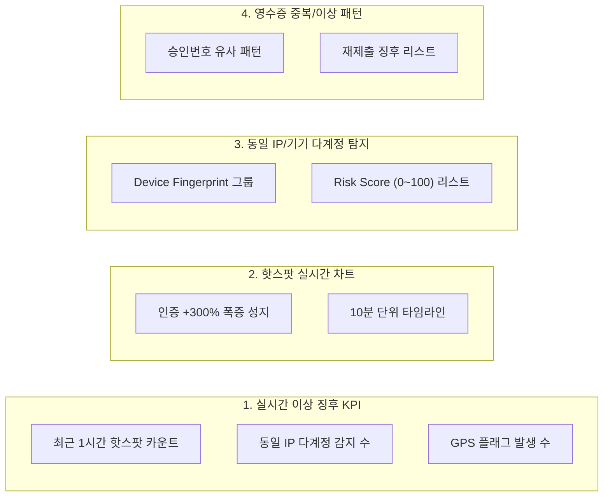

# 팬덤 땅따먹기 상세기획 — 어드민 어뷰징 탐지 모니터링 (v0.3)

> **문서 버전**: v0.3  
> **최종 수정일**: 2026-07-24  
> **문서 상태**: Approved Spec  
> **관련 화면 ID**: `ADM-ABUSE-01` (실시간 이상 징후 대시보드)  
> **관련 정책**: 4겹 어뷰징 방어 규칙 (`fandom_핵심정책_v0.1_20260722.md` #5)  
> **개발 API 참조**: [`docs/03_dev/api/admin_user_abuse_api_v0.1_20260724.md`](file:///Users/jmk/develop/fandom-conquest/docs/03_dev/api/admin_user_abuse_api_v0.1_20260724.md)

---

## 1. 개요 및 비즈니스 목적

본 문서는 '팬덤 땅따먹기' 서비스의 공정한 경쟁 환경을 보장하기 위한 **실시간 이상 징후 핫스팟 모니터링, 동일 IP / Device Fingerprint 다계정 탐지, 4겹 어뷰징 방어 감시 대시보드 (`ADM-ABUSE-01`)**를 정밀 명세한다.

---

## 2. [ADM-ABUSE-01] 이상 탐지 모니터링 대시보드 구성 명세

운영자가 서비스 이상 징후를 한눈에 파악하고 즉각 대응할 수 있도록 4대 주요 위젯으로 구성된다.

### 2.1 위젯 1: 실시간 이상 징후 KPI 카운터
- **최근 1시간 핫스팟 발생 성지 수**: 평시 대비 300% 이상 인증이 급증한 성지 수
- **동일 IP 다계정 탐지 건수**: 동일 IP에서 5개 이상의 계정이 결제 영수증을 제출한 그룹 수
- **GPS 반경 밖 인증 플래그 수**: 성지 반경(예: 200m) 밖에서 제출되어 검수 대기 중인 건수
- **오늘 자동 임시정지 전환 건수**: 룰 엔진에 의해 자동 임시정지 처리된 계정 수

### 2.2 위젯 2: 10분 단위 인증 급증 핫스팟 모니터링
- **10분 타임라인 그래프**: 성지별 10분 단위 영수증 제출 건수 시각화
- **핫스팟 핀 표시**: 기준치(예: 10분간 100건 이상) 초과 시 지도 및 차트에 핫스팟 경고 배지 노출
- **급증 팬덤/유저 분석**: 클릭 시 해당 시간대 성지 인증에 참여한 주요 유저 목록 모달 표시

### 2.3 위젯 3: 동일 IP / Device Fingerprint 다계정 탐지 테이블
- **표시 컬럼**: `IP 주소 / 기기 식별자`, `연관 계정 수`, `제출 성지`, `위험도 점수 (Risk Score)`, `최초 감지 일시`, `액션`
- **위험도 점수 (`Risk Score`: 0~100)**:
  - 동일 기기 다계정 로그인(+30점), 10분 내 연속 제출(+30점), 승인번호 패턴 유사(+40점)
  - Risk Score 80점 이상 시 경고 태그 및 `[자동 임시정지 검수 큐로 이관]` 버튼 활성화

### 2.4 위젯 4: 영수증 중복 / 이상 패턴 탐지 리스트
- **영수증 승인번호 중복/유사 패턴**: 동일 승인번호 재업로드 차단 이력 및 이미지 도용 징후
- **결제 금액 0원/오류 영수증 다량 제출 건**: 영수증 텍스트 OCR 인식 오류 및 훼손 이미지 감시

---

## 3. 탐지 룰 임계값(Threshold) 조작 모달

어드민 운영자가 실시간 이상 탐지 기준을 조정할 수 있는 설정 기능:
- `핫스팟 판단 모니터링 단위`: 5분 / 10분 / 30분
- `핫스팟 인정 증가율`: Normal 대비 +200% / +300% / +500%
- `동일 IP 계정 허용 수`: 3개 / 5개 / 10개 이상 시 Alert 노티 발송
