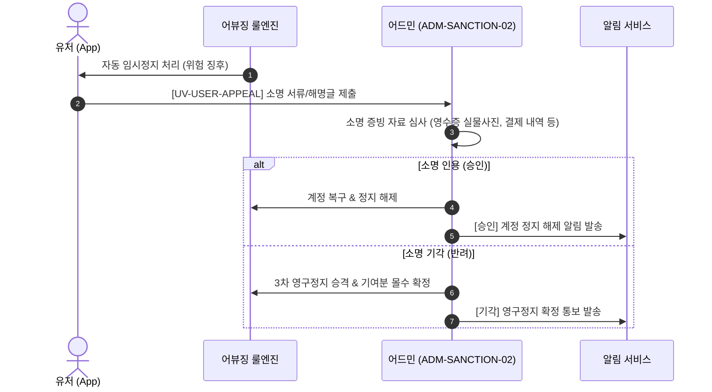

# 팬덤 땅따먹기 상세기획 — 어드민 제재 유저 & 소명 관리 (v0.2)

> **문서 버전**: v0.2  
> **최종 수정일**: 2026-07-23  
> **문서 상태**: Approved Spec  
> **관련 화면 ID**: `ADM-SANCTION-01` (제재 유저 목록 & 몰수 관리), `ADM-SANCTION-02` (유저 인앱 소명 심사 큐)  
> **관련 User View**: `UV-VERIF-05` (반려/정지 모달), `UV-USER-APPEAL` (유저 인앱 소명 신청)  
> **관련 공통 모달**: [`docs/01_planning/02_detail/03_admin/fandom_상세기획_어드민_공통_모달_명세_v0.2_20260723.md`](file:///Users/jmk/develop/fandom-conquest/docs/01_planning/02_detail/03_admin/fandom_상세기획_어드민_공통_모달_명세_v0.2_20260723.md)  
> **개발 API 참조**: [`docs/03_dev/api/admin_user_abuse_api_v0.1_20260724.md`](file:///Users/jmk/develop/fandom-conquest/docs/03_dev/api/admin_user_abuse_api_v0.1_20260724.md)

---

## 1. 개요 및 화면 성격 정의

본 문서는 **현재 1차 경고, 2차 임시정지, 3차 영구정지 등 제재 이력이 있거나 제재가 진행 중인 유저만 모아서 조회/관리하는 전용 모듈(`ADM-SANCTION-01`)**과, 어뷰징 룰 엔진/어드민에 의해 정지된 유저가 인앱(`UV-USER-APPEAL`)을 통해 제출한 소명건을 심사하는 **소명 관리 큐(`ADM-SANCTION-02`)**를 정밀 명세한다.

---

## 2. 화면별 세부 기능 및 워크플로우 명세

### 2.1 [ADM-SANCTION-01] 제재 유저 목록 & 몰수 관리

#### 1) 제재 유저 목록 필터 및 표시 항목
- **대상**: 계정 상태가 `WARNING`(1차경고), `SUSPENDED`(2차임시정지), `BANNED`(3차영구정지) 이거나 과거 제재 이력이 존재하는 유저.
- **필터 조건**:
  - `제재 수위`: 전체, 1차 경고, 2차 임시정지, 3차 영구정지
  - `제재 만료 여부`: 전체, 진행 중(Active), 만료됨(Expired)
  - `제재 사유 카테고리`: 영수증 위조, GPS 조작, 명의/계정 다중 사용, 기타 어뷰징

#### 2) 3단계 수동/자동 제재 수위 명세

| 제재 수위 | 이용 제한 범위 | 점유 기여분 회수/몰수 룰 | 랭킹 롤백 재계산 |
| :--- | :--- | :--- | :--- |
| **1차 경고 (`WARNING`)** | 서비스 이용 유지 (경고 푸시 발송) | 기여분 유지 (몰수 없음) | 롤백 없음 |
| **2차 임시정지 (`SUSPENDED`)** | 지정 기간 (7일 / 14일 / 30일) 앱 접속 차단 | **어뷰징 건으로 판명된 점유 기여분 부분 회수** | 해당 건 점유율 및 성지 점수 차감 롤백 |
| **3차 영구정지 (`BANNED`)** | 계정 영구 차단 (소명 기각 시 확정) | **전체 점유 기여분 전액 몰수** | **전체 참여 성지 랭킹 즉시 롤백 재계산** |

#### 3) 기여분 몰수(회수) 및 롤백 트랜잭션
- 어드민이 제재 시 `[기여분 몰수 처리]` 스위치를 선택하면:
  - 백엔드 점유율 계산 엔진에 `REVOKE_USER_CONTRIBUTION` 이벤트 발행
  - 유저가 남긴 픽셀 점수가 제거되고 관련 성지/팬덤 랭킹이 즉시 재계산 롤백 처리됨.

---

### 2.2 [ADM-SANCTION-02] 유저 인앱 소명 심사 큐

유저가 정지 화면에서 인앱 소명(`UV-USER-APPEAL`)을 신청한 건을 어드민 운영자가 심사하는 수신함.

#### 1) 소명 목록 테이블 필드
- `소명 ID`, `유저 닉네임/ID`, `정지 사유`, `소명 접수일시`, `증빙 첨부파일 유무`, `처리 상태 (대기/승인/기각)`, `담당 어드민`

#### 2) 소명 심사 팝업 모달
- **유저 제출 소명 내용**: 유저 입력 해명 텍스트, 첨부된 실물 영수증 사진 / 카드 결제 내역 캡처 확인
- **심사 액션 버튼**:
  - **`[소명 승인 (인용)]`**: 유저 계정 상태 `ACTIVE`로 복구, 몰수 처리되었던 점수 원복, 승인 앱 푸시 발송
  - **`[소명 기각 (반려)]`**: `3차 영구정지` 승격 확정, 전액 몰수, 기각 사유(예: "증빙 서류 식별 불능 및 위조 판명") 푸시 발송

---

## 3. 어드민 운영자 권한 및 감사 로그 (Audit Logs)

- **권한 매트릭스**:
  - `SUPER_ADMIN`: 3차 영구정지 부여, 전액 기여분 몰수, 소명 최종 기각 승격 권한
  - `OPERATOR`: 1차 경고 / 2차 임시정지(14일 이하) 부여, 소명 1차 심사
- **감사 로그(Audit Log) 자동 기록**:
  - 모든 제재 및 소명 결정 건에 대해 `[어드민 ID, 액션, 유저 ID, 제재수위, 사유, 일시]`를 불변 데이터로 저장.
