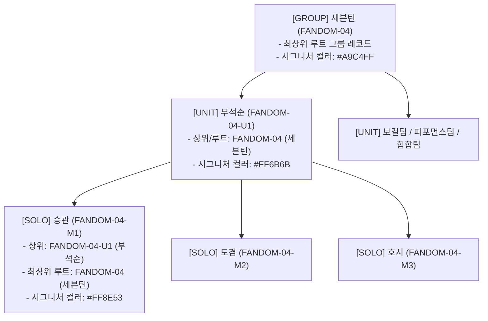

# 팬덤 땅따먹기 상세기획 — 어드민 팬덤 IP & 브랜드 마스터 (v0.2)

> **문서 버전**: v0.2  
> **최종 수정일**: 2026-07-24  
> **문서 상태**: Approved Spec  
> **관련 화면 ID**: `ADM-IP-01` (팬덤 IP & 대표 컬러 브랜드 관리), `ADM-IP-REQUEST-01` (유저 신규 팬덤 신청 심사 큐)  
> **관련 User View**: `UV-AUTH-04` (선호 팬덤 선택), `UV-MAIN-04` (IP 팬덤 필터 바텀시트), `UV-MY-01` (마이페이지 신규 팬덤 신청)  
> **관련 공통 모달**: [`docs/01_planning/02_detail/03_admin/fandom_상세기획_어드민_공통_모달_명세_v0.2_20260723.md`](file:///Users/jmk/develop/fandom-conquest/docs/01_planning/02_detail/03_admin/fandom_상세기획_어드민_공통_모달_명세_v0.2_20260723.md)

---

## 1. 개요 및 비즈니스 목적

본 문서는 '팬덤 땅따먹기' 서비스의 **핵심 자산인 팬덤 브랜드 IP(Artist/Fandom Brand Master), 지도 채색용 대표 식별 컬러(HEX Token & WCAG 2.1 AA 가시성 검수), 3계층(그룹 ↔ 유닛 ↔ 개인) 트라이 매핑 아키텍처, 2차원(지역 × 장르) 분류 체계 및 유저 신규 팬덤 신청 심사 수신함 (`ADM-IP-REQUEST-01`)**의 관리 스펙을 정밀 명세한다.

---

## 2. [ADM-IP-01] 대시보드 화면 와이어프레임 레이아웃 (Visual Structure)

```
+----------------------------------------------------------------------------------------------------+
| [ 팬덤 IP & 브랜드 마스터 관리 ]                                     [신규 팬덤 신청 큐 (5)] [ + IP 신규 등록 ] |
| -------------------------------------------------------------------------------------------------- |
| [지역: 전체(국내/해외) v] [장르: 배우/연기 v] [유형: 전체(그룹/유닛/개인) v] [검색: (팬덤/아티스트) Q]       |
+----------------------------------------------------------------------------------------------------+
| 엠블럼 | 지역 | IP 유형 | 팬덤 IP 명칭 (영문/별칭) | 계층 구조 매핑 (상위 ↔ 하위) | 대표 컬러 | 가중치 | 액션 |
|-------|------|--------|------------------------|---------------------------|----------|-------|------|
| [로고] | 국내 | [그룹]  | 세븐틴 (SEVENTEEN)     | 유닛 3개, 멤버 13명 연결  | ■#A9C4FF | 1.1x  | [수정][상세] |
| [로고] | 국내 | [유닛]  | 부석순 (BSS / SEVENTEEN)| 상위: 세븐틴 / 멤버 3명   | ■#FF6B6B | 1.0x  | [수정][상세] |
| [로고] | 국내 | [개인]  | 승관 (Seungkwan / BSS) | 상위: 부석순 (최상위:세븐틴)| ■#FF8E53 | 1.0x  | [수정][상세] |
| [로고] | 국내 | [개인]  | 변우석 (Byeon Woo-seok)| 소속: VARO엔터 (독립)     | ■#9C36B5 | 1.1x  | [수정][상세] |
+----------------------------------------------------------------------------------------------------+
```

---

## 3. 정밀 데이터 필드 & 마스터 스키마 명세

### 3.1 팬덤 IP 3계층 아키텍처: [그룹 (GROUP) ↔ 유닛 (UNIT) ↔ 개인 (SOLO)] 실질 매핑 예시

그룹, 유닛, 개인 멤버는 각각 독립된 단독 레코드로 엠블럼, 대표컬러, SNS 링크를 등록하되, **[상위 직속 ID (`parent_fandom_id`)]**와 **[최상위 루트 그룹 ID (`root_group_id`)]**를 통해 3단계 계층 구조로 정밀 매핑된다.



#### 📋 실질 데이터 매핑 테이블 예시 (Seventeen - BSS - Seungkwan)

| 구분 | 팬덤 IP ID | 팬덤 정식명 | IP 구분 (`ip_type`) | 직속 상위 ID (`parent_fandom_id`) | 최상위 루트 ID (`root_group_id`) | 시그니처 컬러 |
| :--- | :--- | :--- | :---: | :--- | :--- | :--- |
| **최상위 그룹** | `FANDOM-04` | **세븐틴 (SEVENTEEN)** | `GROUP` | `null` (루트) | `FANDOM-04` (자기자신) | `#A9C4FF` |
| **중간 유닛** | `FANDOM-04-U1` | **부석순 (BSS)** | `UNIT` | `FANDOM-04` (세븐틴) | `FANDOM-04` (세븐틴) | `#FF6B6B` |
| **개인 멤버** | `FANDOM-04-M1` | **승관 (Seungkwan)** | `SOLO` | `FANDOM-04-U1` (부석순) | `FANDOM-04` (세븐틴) | `#FF8E53` |

---

### 3.2 2차원 분류 체계: [지역 (`region_type`)] × [장르 (`genre_category`)]

#### 1) 1축: 국가 / 지역 구분 (`region_type`)
- `DOMESTIC`: **국내** (대한민국 기반 아티스트/배우/IP)
- `GLOBAL`: **해외** (해외/글로벌 아티스트/배우/POP/J-POP 등)

#### 2) 2축: 장르 구분 (`genre_category`)

| 장르 코드 | 장르 라벨명 | 대표 예시 아티스트 / 팬덤 / 브랜드 |
| :--- | :--- | :--- |
| `IDOL_GROUP` | **K-POP 아이돌 그룹** | 세븐틴, 방탄소년단, 뉴진스, 에스파, 아이브 등 |
| `SINGER_SOLO` | **가수 / 솔로** | 아이유, 태연, 제니, 뷔, 백현 등 |
| `TROT_BALLAD` | **트롯 / 성악 / 발라드** | 임영웅, 영탁, 김호중, 이찬원 등 |
| `ACTOR` | **배우 / 연기** | **변우석, 김수현, 박은빈, 차은우, 송중기 등** |
| `SPORTS` | **스포츠 선수 / 팀** | **손흥민, 김연경, T1(E-스포츠), 프로야구/축구 팀** |
| `CREATOR_VTUBER` | **크리에이터 / VTuber** | 우왁굳, 이세돌(이세계아이돌), 왁타버스 등 |
| `ANIME_GAME` | **애니 / 캐릭터 / 게임 IP** | **귀멸의 칼날, 원신, 산리오, 자이언트 펭수 등** |

---

### 3.3 공식 SNS & 웹사이트 링크 스키마

| 데이터 필드 Key | 필드명 | 데이터 포맷 | 설명 및 예시 |
| :--- | :--- | :--- | :--- |
| `sns_instagram` | **인스타그램 URL** | String (URL) | `https://www.instagram.com/saythename_17/` |
| `sns_youtube` | **유튜브 공식 채널 URL**| String (URL) | `https://www.youtube.com/@SEVENTEEN` |
| `sns_twitter` | **X (트위터) URL** | String (URL) | `https://x.com/pledis_17` |
| `sns_community` | **공식 커뮤니티 / 위버스 URL**| String (URL) | `https://weverse.io/seventeen/feed` |

### 3.4 점수 이중 집계 & 단방향 상향 상속 백엔드 계산 룰 (Upward Roll-up Score Engine)

- **단방향 상향 상속 (Upward Roll-up Only)**:
  - 개인 멤버 (`FANDOM-04-M1` 승관) 또는 유닛 (`FANDOM-04-U1` 부석순)으로 인증 성공 시:
    1. 개인/유닛 DB 스코어 `score = score + 1` 반영 (개인/솔로 랭킹 반영)
    2. 직속 상위 유닛 및 `root_group_id` 최상위 단체 그룹 (`FANDOM-04` 세븐틴) 스코어 `score = score + 1` **자동 상향 상속 합산** (통합 그룹 랭킹 반영)
- **하향 분배 금지 (No Downward Distribution)**:
  - 유저가 단체 그룹 (`FANDOM-04` 세븐틴)으로 인증한 경우, 단체 그룹 스코어만 `+1`점 상승하며 **하위 개인 멤버 레코드에는 점수를 일절 분배하지 않음**.
- **지도 표기 롤 분담**:
  - 성지 핀 마커: 유저가 응원한 **개인 최애의 시그니처 컬러 및 엠블럼** 표기
  - 25구 영토 채색: **최상위 루트 그룹 합산 점수** 기준 채색

---

## 4. 정밀 모달 & 전용 심사 툴 명세 (Modal & Tool Specs)

### 4.1 🔍 [모달 1] 팬덤 IP 신규 등록 / 수정 모달 (`MODAL-IP-EDIT`)

1. **지역 & 장르 & 3계층 구조 정보**:
   - `국가/지역 (region_type)` Radio: **`[x] DOMESTIC (국내)`** / **`[ ] GLOBAL (해외)`**
   - `장르 (genre_category)` Select: K-POP 아이돌 그룹, 가수/솔로, 배우/연기, 스포츠, 트롯/발라드, VTuber, 애니/게임 중 선택
   - `IP 구분 유형 (ip_type)` Radio: **`[ ] GROUP (그룹)`** / **`[x] UNIT (유닛)`** / **`[ ] SOLO (개인/배우)`**
   - `직속 상위 IP 연결 (parent_fandom_id)`: AutoComplete Select (예: `FANDOM-04 (세븐틴)` 선택 시 자동으로 루트 그룹 ID 매핑)
   - `팬덤 정식명` (필수, 예: 부석순), `영문 공식명` (필수, 예: BSS)
   - `검색 이명/별칭 (Aliases)` (선택, 쉼표 구분 - 예: `부석순, BSS, 승관, 도겸, 호시, 세븐틴`)
   - `소속 기획사` (필수, 예: 플레디스 엔터테인먼트)
2. **공식 SNS & 웹사이트 채널 정보**: `인스타그램 URL`, `유튜브 URL`, `X(트위터) URL`, `공식 커뮤니티/위버스 URL`
3. **브랜드 자산 & 시그니처 컬러**:
   - `팬덤 엠블럼/로고 이미지`: 파일 업로드 (PNG/SVG, 512x512px)
   - `대표 식별 컬러 (HEX Token)`: **Color Picker 제공** (예: `#FF6B6B`)
   - **자동 시각 가시성 검수기 (Contrast Checker)**: `≥ 4.5:1` 통과 시 **`[WCAG AA 통과 - 정상]`** 배지 노출
4. **점령전 파라미터**: `점령 가중치 배율 (weight_mult)` (Slider/Input: `1.00x` ~ `2.00x`)
5. **Footer Buttons**: `[취소]` / `[저장 확정]`

---

### 4.2 🔍 [모달 2] 유저 신규 팬덤 신청 전용 심사 수신함 (`ADM-IP-REQUEST-01`)

1. **신청 목록 테이블 컬럼 명세**:
   - `신청 ID`, `신청 일시`, `신청 유저 닉네임`, `신청 팬덤/아티스트명`, `신청 장르`, `신청 사유 / 대표곡`, `처리 상태 (대기/승인/반려)`, `관리 액션`
2. **심사 액션 UX 워크플로우**:
   - **`[승인 & 마스터 자동등록]`**:
     - 클릭 시 신청 유저가 입력한 팬덤명, 아티스트명이 **Pre-fill(자동 입력)된 상태로 `MODAL-IP-EDIT` 등록 팝업이 바로 오픈됨**.
     - 어드민이 로고와 대표 컬러 지정 후 `[저장 확정]` 클릭 시, **해당 유저에게 "신청하신 [{fandom_name}] 팬덤이 정식 등록되었습니다!" 알림 푸시 발송**.
   - **`[신청 반려]`**:
     - 클릭 시 반려 사유 입력 모달 팝업 오픈 (예: "이미 동일한 팬덤 '뉴진스'가 등록되어 있습니다.") → 입력 후 반려 처리 및 신청 유저에게 사유 푸시 발송.

---

### 4.3 🔍 [드로어 1] 팬덤 IP 상세 & 계층 연결 정보 Drawer (`DRAWER-IP-DETAIL`)
- 오른쪽 450px 슬라이딩 오픈
- **상세 정보 탭**: 엠블럼, 정식명, 지역(국내/해외), 장르, IP유형(그룹/유닛/개인), 공식 SNS 4종 바로가기 버튼, 시그니처 컬러 칩
- **3계층 연결 링킹 탭 (Hierarchical Relations Tab)**:
  - **그룹 IP 조회 시**: 소속 유닛 및 개인 멤버 N명의 엠블럼 칩 바로가기
  - **유닛 IP 조회 시**: 상위 그룹 바로가기 + 소속 멤버 3명 바로가기
  - **개인 IP 조회 시**: 직속 유닛 및 최상위 루트 그룹 바로가기 칩 제공
- **귀속 성지/유저 탭**: 1위 점유 중인 성지 N곳 목록 & 메인 팬덤으로 선택한 회원 통계
