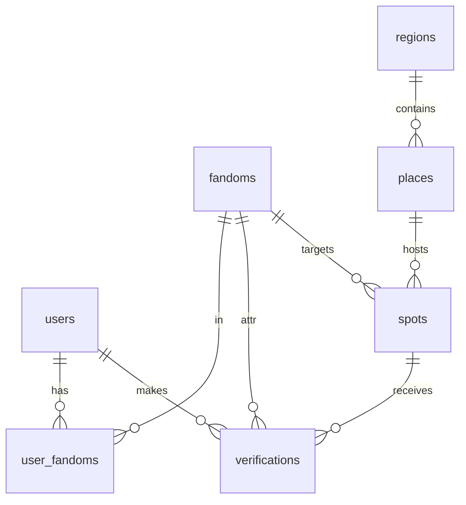

> [1. 기획 개요 & 핵심 정책]의 개념·정책을 DB로 옮긴 스키마. **점유(occupancy)는 집계 테이블 없이 verifications에서 즉석 계산**(MVP, 구 1~2개라 부담 작음).
# ERD

# 테이블 상세
## users (팬)
user_id(PK) · email · auth_provider(email/social) · locale · created_at
선호 팬덤은 다중이라 user_fandoms로 분리.
## user_fandoms (선호 팬덤, N:N)
user_id(FK) · fandom_id(FK) — 복합 유니크. 지도 필터·인증 기본값.
## fandoms (팬덤)
fandom_id(PK) · name(IP) · color. 운영자 등록. 점령·랭킹 집계 단위.
## regions (구/땅)
region_id(PK) · name. 점유 2레벨의 상위. 행정동 미분할.
## places (장소)
place_id(PK) · name(상호) · address · lat · lng · **business_number(UNIQUE)** · region_id(FK) · status(active/closed)
유일키=business_number. 폐업 시 status=closed(삭제 금지).
## spots (성지)
spot_id(PK) · place_id(FK) · type(event/permanent) · event_name · target_fandom_id(FK, nullable) · start_date · end_date · status(active/archived)
이벤트형=기간, 상설형=장소고정. 종료 시 archived.
## verifications (인증)
verification_id(PK) · user_id(FK) · spot_id(FK) · fandom_id(FK, 귀속) · **dedup_key(UNIQUE)** · transaction_at · amount · lat · lng · gps_ok · status(대기/자동승인/수동검수/승인/반려) · reject_reason · created_at
어뷰징 1차=dedup_key UNIQUE. 점수=승인 건수(amount는 참고).
# 점유·점령 계산 (파생 · 테이블 없음)
- **성지 점유**: 해당 spot의 승인 verification을 팬덤별 집계. 이벤트형=기간 내, 상설형=최근 14일 시간가중.
- **구 점유**: 그 구 소속 spot들의 팬덤별 합산.
- **점령 판정**: 구 점유율 40%↑ 1위 → 점령(컬러링). 동점=선점 우선, 모두 40% 미만=중립.
- 전부 verifications 대상 실시간 쿼리, 캐시 없음(MVP).
# (구현 메모)
- 쿨다운: (user_id, spot_id, KST 날짜) UNIQUE 또는 카운트 체크.
- 잠정/확정: status=자동승인은 즉시 집계 포함, 수동검수는 승인 후 포함.
- 감쇠: 집계 쿼리에서 transaction_at 기준 가중(상설 14일), 이벤트는 기간 필터.
