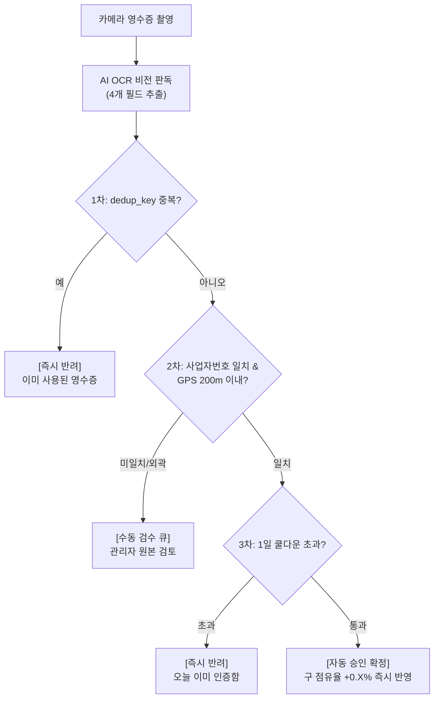

# 팬덤 땅따먹기 상세기획 — 인증 & 어뷰징 방어 (Verification & Anti-Abuse)

> 본 문서는 [fandom_핵심정책_v0.1_20260722.md](file:///Users/jmk/develop/fandom-conquest/docs/01_planning/01_overview/fandom_핵심정책_v0.1_20260722.md)의 인증(Verification) 메커니즘과 **4겹 어뷰징 방어 체계, OCR 추출 및 반려 메시지 기능 정의**를 다룬다.

---

## 1. 영수증 OCR 인증 파이프라인

유저가 성지에서 영수증을 촬영하여 제출 시 실행되는 단계별 인증 프로세스입니다.

### 1.1 AI OCR 4개 추출 필드
1. **사업자등록번호 (Business Registration No)**: 10자리 숫자 (성지 장소 일치 대조용)
2. **거래일시 (Transaction Datetime)**: YYYY-MM-DD HH:mm:ss (이벤트 운영기간 내 결제 확인용)
3. **결제금액 (Total Amount)**: KRW 결제 금액
4. **승인번호 (Approval No)**: 카드/현금영수증 승인번호 8~12자리 (고유 중복 차단키)

---

## 2. 4겹 어뷰징 방어 상세 규격

### 2.1 1차 방어: 승인번호 유니크 키 (Dedup Key)
* **`dedup_key` 규칙**: `[사업자등록번호] + [승인번호]` (승인번호 미인식 시 `[사업자번호] + [거래일시] + [결제금액]` 조합키)
* **목적**: 동일 영수증 재촬영, 이미지 캡처/도용을 DB Unique 인덱스로 100% 근본 차단.

### 2.2 2차 방어: GPS 반경 대조 (Location Verification)
* **반경 규격**: 성지 지점 기준 **반경 200m 이내** 유저 위치 확인.
* **유연한 처리**: 반경 밖에서 업로드 시 즉시 하드 반려하지 않고 **`플래그(Flag)`** 처리 후 어드민 **수동 검수 큐**로 전달 (통신 장애/매장 내부 GPS 오차 유저 포용).

### 2.3 3차 방어: 쿨다운 & 건수 기반 점수
* **쿨다운 규칙**: 유저 1인당 동일 성지에서 **1일 1회 인증 제한** (자정 KST 기준 리셋).
* **1건 = 1점 고정**: 결제 금액과 무관하게 1건당 1점 고정 부여 ➔ 소액 결제 반복 펌핑 행위 무효화.

### 2.4 4차 방어: 이상탐지 수동 검수 큐 (Anomaly Detection)
* 단시간 내 특정 매장 인증 건수 이상 급증, 동일 IP 다계정 접근 탐지 시 자동 승인 즉시 보류 및 어드민 수동 검수 큐 이관.

---

## 3. 인증 결과 처리 및 에러 UX 메시지 명세

### 3.1 결과 판정 및 피드백 UX

| 판정 상태 | 시스템 처리 | 유저 UI 피드백 토스트/팝업 메시지 |
| :--- | :--- | :--- |
| **자동 승인** | 점유율 즉시 반영 (`+0.X%`) | 🎉 **"인증 완료! [마포구] [뉴진스] 점유율이 +0.4% 상승했습니다!"** |
| **수동 검수 이관** | 어드민 검수 대기 | ⏳ **"영수증 판독 중입니다. 관리자 확인 후 10분 내에 처리됩니다."** |
| **중복 반려** | Hard Reject | ⚠️ **"이미 인증에 사용된 영수증입니다."** |
| **쿨다운 반려** | Hard Reject | ⏳ **"해당 성지는 오늘 이미 인증하셨습니다. 내일 다시 시도해 주세요!"** |
| **사업자 미일치**| Hard Reject / 재촬영 안내 | ❌ **"해당 성지의 영수증이 아닙니다. (사업자등록번호 미일치)"** |
| **OCR 스캔 실패**| 수동 검수 이관 | 📸 **"영수증 글자가 구겨지거나 흐릿합니다. 선명하게 다시 찍어주세요."** |

---

## 4. 개인정보 보호 & 마스킹 처리

* **영수증 원본 이미지 파기**: OCR 필요 필드(사업자번호, 일시, 금액, 승인번호) 파싱이 완료되면 영수증 원본 이미지에서 마스킹(카드번호 일부 제거) 처리 후 **최대 7일 내 원본 파기**.
* **데이터 저장 최소화**: 개인 신용카드 정보는 절대 저장하지 않음.
