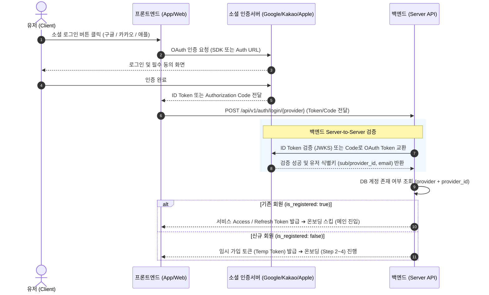

# 팬덤 땅따먹기 기술명세 — 소셜 OAuth 연동 가이드 (Social Auth Spec)

> 본 문서는 [fandom_상세기획_온보딩_로그인_v0.1_20260722.md](file:///Users/jmk/develop/fandom-conquest/docs/01_planning/02_detail/02_user_view/fandom_상세기획_온보딩_로그인_v0.1_20260722.md)의 기획 정책을 바탕으로 **구글, 카카오, 애플 소셜 OAuth 연동 및 백엔드/프론트엔드 API 명세**를 정의하는 개발 기술 문서입니다.

---

## 1. 표준 OAuth 인증 아키텍처 (ID Token / Auth Code Server Verification)

보안성 강화 및 글로벌 서비스 확장을 위해, 프론트엔드는 각 소셜 프로바이더의 인증 창을 열어 토큰/코드를 수집하는 역할만 수행하고, **실제 토큰 검증 및 유저 식별, 서비스 JWT 발급은 백엔드가 소셜 인증 서버와 Server-to-Server로 직접 통신**하여 처리합니다.



---

## 2. 프로바이더별 개발 준비물 및 연동 유의사항

| 프로바이더 | 개발 준비물 및 콘솔 설정 | 인증 수단 | 개발 시 핵심 체크포인트 |
| :--- | :--- | :--- | :--- |
| **구글<br/>(Google)** | • Google Cloud Console 프로젝트 생성<br/>• OAuth 2.0 클라이언트 ID (Web, Android, iOS 플랫폼별 생성) | GIS SDK 기반<br/>`id_token` 전달 | • 백엔드에서 Google Public Keys (JWKS)를 통해 `id_token` 서명 및 `aud` (클라이언트 ID) 일치 여부 필수 검증. |
| **카카오<br/>(Kakao)** | • Kakao Developers 앱 생성<br/>• 카카오 로그인 활성화 & Redirect URI 설정<br/>• 동의항목 (이메일, 프로필 정보) | JS SDK 또는 REST API<br/>`Authorization Code` | • REST API 방식 사용 시 Redirect URI 파라미터 전달 정확성 유지.<br/>• 카카오 이메일은 비인증 상태일 수 있으므로 `provider` + `provider_id` 고유 연동키를 DB PK로 사용. |
| **애플<br/>(Apple)** | • Apple Developer Paid Account<br/>• Services ID, Key (.p8 파일), Key ID, Team ID<br/>• Primary App ID 및 Redirect URL 등록 | Sign in with Apple<br/>`identity_token` (JWT) | • **[필수 주의]** 애플은 최초 1회 로그인 시에만 유저 이름/이메일을 반환하므로, 프론트엔드가 전달받은 정보를 유실 없이 즉시 DB에 첫 가입 정보로 기록해야 함.<br/>• 애플 이메일 마스킹(Private Relay) 대처 로직 포함. |

---

## 3. 프론트엔드 - 백엔드 API 명세 규격

### 3.1 소셜 인증 요청 API (`POST /api/v1/auth/login/{provider}`)
* **Path Parameter**: `provider` (`google` | `kakao` | `apple`)
* **Request Body**:
```json
{
  "auth_type": "id_token", // "id_token" 또는 "code"
  "token_or_code": "eyJhbGciOiJSUzI1NiIs...",
  "redirect_uri": "https://fandomconquest.com/oauth/callback/kakao" // 카카오 code 인증 시 필요
}
```

* **Response Body (신규 회원인 경우)**:
```json
{
  "status": 200,
  "data": {
    "is_registered": false,
    "temp_token": "eyJhbGciOi...", // Step 2~4 온보딩 완료 API 호출 시 사용할 임시 토큰
    "provider_info": {
      "provider": "kakao",
      "email": "user@kakao.com",
      "profile_image": "https://k.kakaocdn.net/..."
    }
  }
}
```

* **Response Body (기존 회원인 경우)**:
```json
{
  "status": 200,
  "data": {
    "is_registered": true,
    "tokens": {
      "access_token": "eyJhbGciOi...",
      "refresh_token": "def456..."
    },
    "user": {
      "user_id": "usr_99812",
      "nickname": "뉴진스짱",
      "main_fandom_id": "fandom_newjeans"
    }
  }
}
```

---

### 3.2 온보딩 완료 및 회원가입 최종 API (`POST /api/v1/auth/signup`)

온보딩 Step 2(약관동의), Step 3(프로필/닉네임), Step 4(선호 IP) 완료 시 호출합니다.

* **Headers**: `Authorization: Bearer {temp_token}`
* **Request Body**:
```json
{
  "terms_agreed": {
    "service_terms": true,
    "privacy_policy": true,
    "location_terms": true,
    "marketing_push": false
  },
  "nickname": "덕질마스터",
  "profile_image_url": "https://...",
  "selected_fandom_ids": ["fandom_newjeans", "fandom_ive"],
  "main_fandom_id": "fandom_newjeans",
  "custom_ip_request": "신인그룹 X" // 선택 사항 (선호 IP 신청 시)
}
```
* **Response Body**:
```json
{
  "status": 201,
  "data": {
    "message": "회원가입 완료",
    "tokens": {
      "access_token": "eyJhbGciOi...",
      "refresh_token": "def456..."
    },
    "user": {
      "user_id": "usr_99813",
      "nickname": "덕질마스터",
      "main_fandom_id": "fandom_newjeans"
    }
  }
}
```
