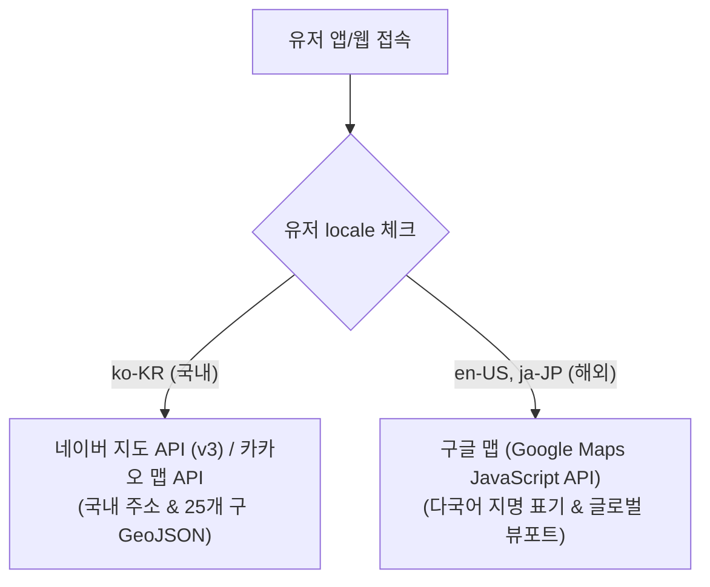

# 팬덤 땅따먹기 기술명세 — 지도 · LBS · GeoJSON 연동 가이드 (Map & LBS Spec)

> 본 문서는 [fandom_상세기획_장소_성지_v0.2_20260817.md](file:///Users/jmk/develop/fandom-conquest/docs/01_planning/02_detail/02_user_view/fandom_상세기획_장소_성지_v0.2_20260817.md)의 기획 정책을 바탕으로 **네이버/카카오/구글 맵 SDK 연동, BBOX Spatial Query, 서울시 25개 구 GeoJSON 렌더링, LBS 반경 200m Haversine 알고리즘 및 클러스터링 명세**를 정의하는 개발자 전용 기술 문서입니다.

---

## 1. 지도 프로바이더 하이브리드 연동 아키텍처

유저의 접속 `locale` 및 디바이스 환경에 따라 지도 SDK 렌더링 엔진을 서버/프론트엔드가 분기 연동합니다.



### 1.1 프로바이더별 SDK 연동 사양
* **국내 유저 (`ko-KR`)**: **Naver Maps JavaScript API v3 / Kakao Maps API**
  * **목적**: 국내 도로명 주소 정밀 지적도 표기, 서울시 25개 구 행정구역 GeoJSON 렌더링.
* **해외 유저 (`en-US`, `ja-JP`, `zh-CN` 등)**: **Google Maps JavaScript API**
  * **목적**: 해외 IP 접속 대응, 다국어 영문/일문 라벨링 및 글로벌 접근성 보장.

---

## 2. GeoJSON 구(區) 단위 점령 렌더링 기술 명세

### 2.1 행정구역 데이터 구조 (`seoul_districts.geojson`)
서울시 25개 구(마포구, 강남구, 성동구 등) 경계 위경도 좌표 Polygon / MultiPolygon 데이터를 클라이언트 지도 레이어에 얹어 채색합니다.

### 2.2 1위 팬덤 점령 Fill Polygon 스타일
```javascript
// GeoJSON 레이어 스타일링 예시
const districtStyle = {
  fillColor: fandomColorHex,  // 40% 이상 단독 1위 팬덤의 대표 Hex Color (예: '#0055FF')
  fillOpacity: isDominant ? 0.4 : 0.0, // 40% 이상 점령 시 0.4, 미달/중립 시 0.0 (투명)
  strokeColor: isCompeting ? '#FF0000' : fandomColorHex, // 경합 시 연한 빨간 점선
  strokeWeight: 2,
  strokeOpacity: 0.8
};
```

---

## 3. BBOX (Bounding Box) Spatial Query & 클러스터링

지도 이동 시 성능 과부하를 방지하기 위해 현재 뷰포트 화면 바운딩 박스 범위 내의 성지 핀만 백엔드 Spatial Index (`PostGIS / Turf.js`)로 조회합니다.

### 3.1 BBOX API 요청 인터페이스 (`GET /api/v1/spots/map-bbox`)
* **Query Parameters**:
  * `min_lat`: 현재 화면 남서쪽 위도 (예: `37.5401`)
  * `min_lng`: 현재 화면 남서쪽 경도 (예: `126.9123`)
  * `max_lat`: 현재 화면 북동쪽 위도 (예: `37.5612`)
  * `max_lng`: 현재 화면 북동쪽 경도 (예: `126.9456`)
  * `zoom_level`: 현재 지도 줌 레벨 (예: `14`)
  * `fandom_id`: IP 필터 적용 시 선택된 팬덤 ID (선택 사항)

### 3.2 줌 레벨별 마커 클러스터링 (Marker Clustering)
* **줌 레벨 1 ~ 12 (광역 서울시 뷰)**:
  * 핀 밀집 구역은 숫자가 표기된 `[클러스터 마커 (예: 📍 15)]`로 그룹화하여 렌더링 성능 최적화.
* **줌 레벨 13 ~ 18 (성지 상세 동네 뷰)**:
  * 개별 성지 마커 핀(이벤트 `D-Day 뱃지`, 상설형 핀 구분)으로 확대 분리 렌더링.

---

## 4. LBS 반경 200m Haversine 거리 계산 및 수동 검수 판정

영수증 인증 시 유저의 실시간 좌표와 성지 좌표 간의 물리적 거리를 백엔드에서 Haversine 알고리즘으로 판정합니다.

```python
# 백엔드 Haversine 거리 계산 공식 (Python 예시)
from math import radians, cos, sin, asin, sqrt

def calculate_distance(lat1, lon1, lat2, lon2):
    # 위경도를 라디안으로 변환
    lon1, lat1, lon2, lat2 = map(radians, [lon1, lat1, lon2, lat2])
    dlon = lon2 - lon1
    dlat = lat2 - lat1
    a = sin(dlat/2)**2 + cos(lat1) * cos(lat2) * sin(dlon/2)**2
    c = 2 * asin(sqrt(a))
    r = 6371  # 지구 반지름 (km)
    return c * 1000  # 미터(m) 단위 반환

# 판정 로직
distance_m = calculate_distance(user_lat, user_lng, spot_lat, spot_lng)
if distance_m <= 200:
    is_gps_valid = True  # 200m 이내 자동 승인 후보
else:
    is_gps_valid = False # 200m 초과 시 수동 검수 큐(ADM-VERIF-04) 이관
```
